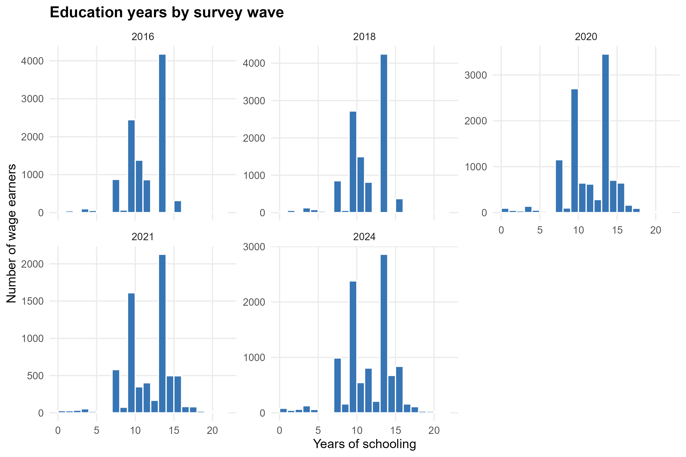
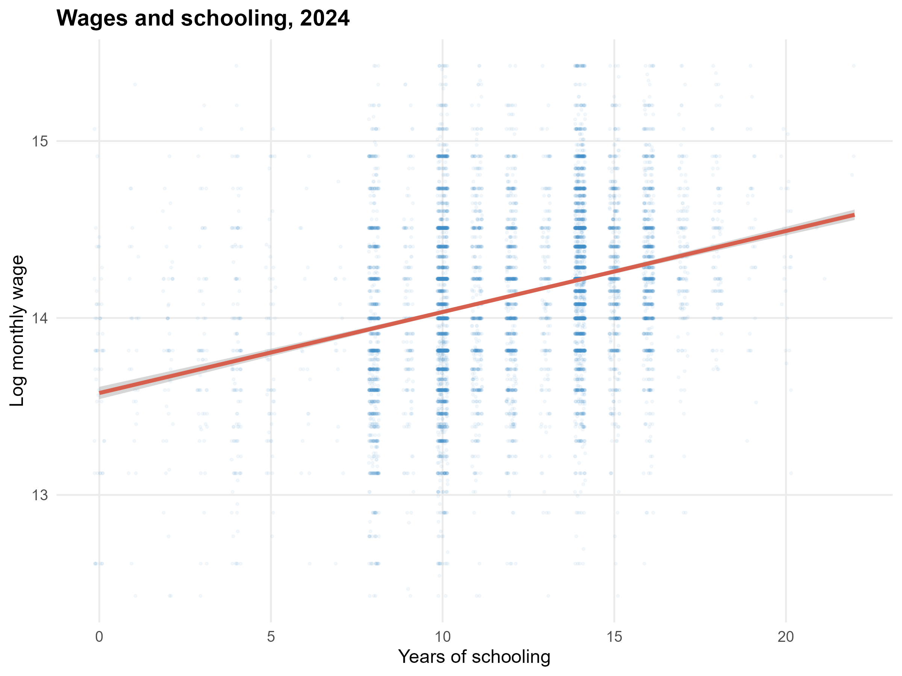
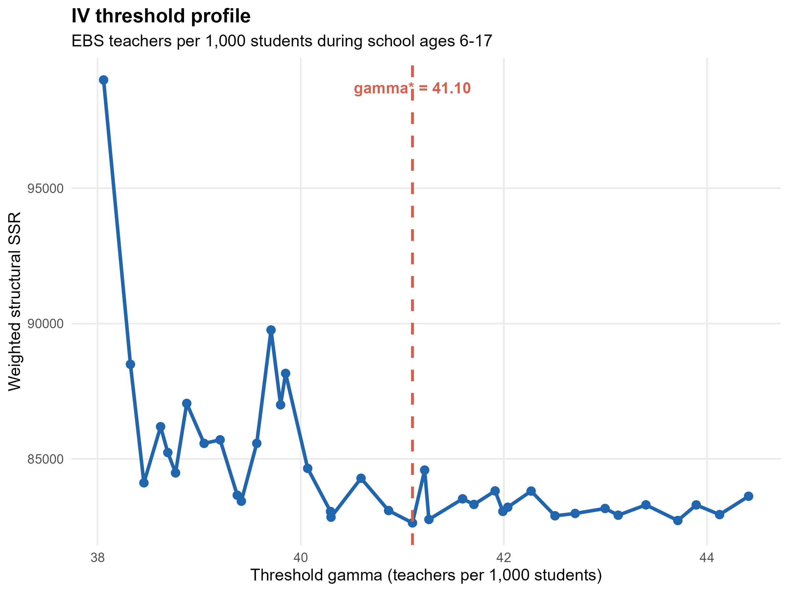
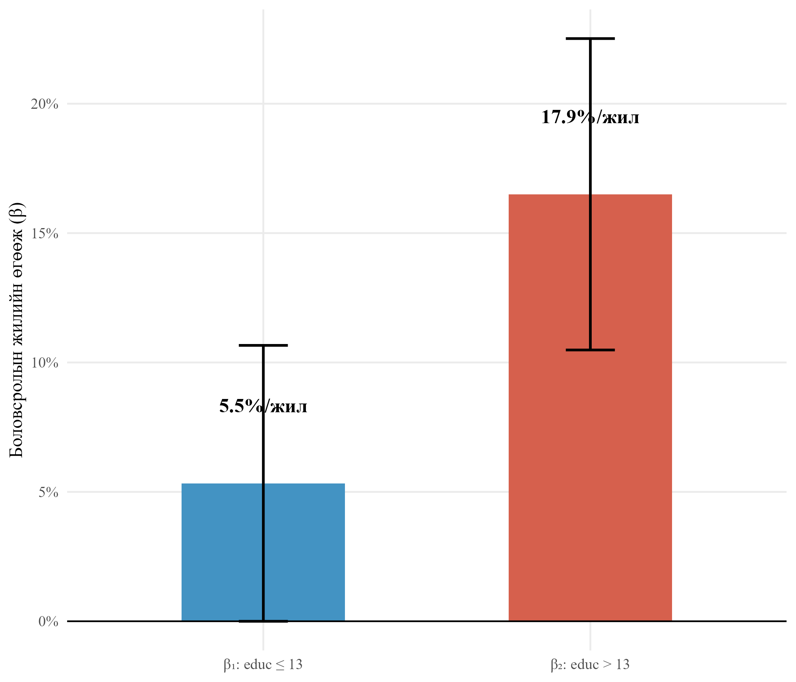
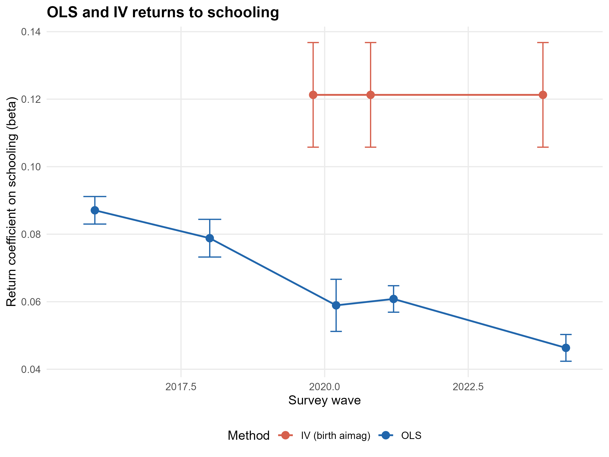

# ТОВЧИЛСОН ҮГС

| Товчлол | Англи нэр | Монгол нэр |
|---|---|---|
| ЭХБК | Ordinary Least Squares (OLS) | Энгийн хамгийн бага квадратын арга |
| ХШХБК | Two-Stage Least Squares (2SLS) | Хоёр шатлалт хамгийн бага квадратын арга |
| ХХБР | IV Threshold Regression (IVTR) | Хэрэгсэл хувьсагчтай босго утгат регресс |
| ӨНЭЗС | Household Socio-Economic Survey (HSES) | Өрхийн нийгэм, эдийн засгийн судалгаа |
| ҮСХ | National Statistics Office (NSO) | Үндэсний Статистикийн Хороо |
| ЕБС | General Education School | Ерөнхий боловсролын сургууль |
| СБЭ | School-age Basic Education exposure | Сургуульд хамрагдсан жилийн дундаж нөөц |
| СБХ | Sup-Wald Bootstrap | Дээд Вальдын бүүтстрап шалгуур |
| ХБК | Sargan/Hansen J test | Хэт тодорхойлогдсон байдлын шалгуур |
| ВДБ | Wild Cluster Bootstrap | Кластерын Вайлд бүүтстрап стандарт алдаа |
| ВТА | Anderson–Rubin (1949) robust CI | Сул хэрэгсэлд тэсвэртэй итгэлийн интервал |
| JEL | Journal of Economic Literature | Эдийн засгийн уран зохиолын ангилал |
| APA | American Psychological Association | АПА ишлэлийн стандарт |

# НЭР ТОМЬЁОНЫ ТАЙЛБАР

**Боловсролын бодит өгөөж** — нэмэлт нэг жил суралцсаны үр дүнд цалингийн логарифмд гарах хувийн өсөлт буюу Минсерийн (Mincer, 1974) тэгшитгэлийн боловсролын коэффициент.

**Эндоген регрессор** — алдааны гишүүнтэй хамааралтай тайлбарлах хувьсагч; ийм нөхцөлд ЭХБК үнэлгээ хазайлттай гардаг.

**Хэрэгсэл хувьсагч (Z)** — эндоген регрессорыг тайлбарлах боломжтой боловч хамаарлын тэгшитгэлийн алдаа гишүүнтэй хамааралгүй тусгай хувьсагч.

**Босго хувьсагч (q)** — өгөгдлийг хоёр регимд хуваах урьдчилсан тодорхойлсон хэмжигдэхүүн; Caner–Hansen (2004) загварт энэ нь эндоген биш байх ёстой.

**γ\*** — алдааны квадратуудын нийлбэрийг хамгийн бага болгож сонгогдсон оновчтой босгоны утга.

**Дээд Вальдын шалгуур (SupWald)** — босго оршихгүй гэсэн тэг таамаглалыг турших, грид дээрх Вальдын шалгуурын дээд утгад үндэслэсэн стандарт.

**Радемахерийн жинт Вайлд бүүтстрап** — алдаа гишүүнийг ±1 жинтэй санамсаргүй хувиргаж дахин түүвэрлэх стандарт бус хуваарилалтад тэсвэртэй p-утга гаргах арга.

**ЕБС-ийн нөөц** — сум, аймагт ногдох ерөнхий боловсролын сургуулийн багш-сурагчийн харьцаа буюу 1,000 сурагчид ногдох багшийн тоо. Энд тухайн хувь хүний 6–17 насны үед ногдсон дундаж нөөцийг хэлнэ.

# ХУРААНГУЙ

Монгол Улсын хөдөлмөрийн зах зээл дэх боловсролын бодит өгөөжийг тодорхойлох нь хүмүүн капиталын хөрөнгө оруулалтын үр дүнг үнэлэх, дээд боловсрол ба ерөнхий боловсролын бодлогыг чиглүүлэх суурь асуудал юм. Энэхүү судалгаагаар Монгол Улс дахь боловсролын нэмэлт нэг жилийн өгөөжийг хэрэгсэл хувьсагчтай (Two-Stage Least Squares, 2SLS) болон Caner, Hansen (2004) нарын хэрэгсэл хувьсагчтай босго утгат регрессийн (ХХБР) аргачлалаар үнэлэхийг зорилоо. Үндэсний Статистикийн Хорооны Өрхийн нийгэм, эдийн засгийн судалгааны (ӨНЭЗС) 2016, 2018, 2020, 2021, 2024 оны таван давалгаагаас 25–60 насны цалинтай ажиллагч 49,366 хүний ажиглалтыг шинжилгээнд ашиглав. Эндоген хазайлтыг засахад төрсөн аймгийн ангилал (birth_aimag) хэрэгсэл хувьсагчийг үндсэн стратеги болгон сонгож, Улаанбаатар хүртэлх зайн логарифм болон 1212.mn-ээс татсан ерөнхий боловсролын сургуулийн (ЕБС) сургуулийн насны үеийн нөөцийн хэмжүүрийг бат бөх байдлын шалгалтад ашиглав. Үр дүнгээс боловсролын нэмэлт нэг жилийн өгөөж ЭХБК-аар 6.5%, төрсөн аймгийн хэрэгсэл хувьсагчтай 2SLS-ээр 12.9% буюу эндоген хазайлтыг засахад өгөөж бараг хоёр дахин өсдөг нь тогтоогдов (эхний шатны F = 16.39, нийт түүвэр 11,924). Caner–Hansen-ийн ХХБР шинжилгээ нь экзоген босго хувьсагчид (ЕБС-ийн насны үеийн багш-сурагчийн харьцаа, нас 12-ын үеийн багш-сурагчийн харьцаа, 2008 оны боловсролын шинэчлэлд хамаарагдсан байдал, Улаанбаатар хүртэлх зайн логарифм) формал бүтцийн босго оршиж буйг (B = 999 удаагийн Вайлд бүүтстрапын p = 0.001) нотолж байна. Гэхдээ хамгийн хамгаалагдах ЕБС-ийн нөөцийн босго дээр регим хоорондын налуугийн ялгаа статистикийн ач холбогдолгүй гарсан тул "босго оршиж байгаа боловч өгөөжийн нэг жилийн ашгийн ялгаа нь босго хувьсагчаас хамаарч өөр өөр" гэсэн болгоомжтой томьёоллыг баримталж байна. Хекманы сонголтын засвар, кластерын Вайлд бүүтстрап стандарт алдаа, p1–p99 outlier trim, educ_years==0 ажиглалт хасах сорилт зэрэг бат бөх байдлын зургаан шалгалтад үндсэн коэффициент тогтвортой үлдсэн. Иймд хүмүүн капиталын бодлогын хүрээнд (i) дээд боловсролд хүрэх санхүүгийн саадыг бууруулах, (ii) ерөнхий боловсролын сургуулийн багшийн нөөцийг орон нутгийн түвшинд тэгшитгэх, (iii) ӨНЭЗС-д боловсролын чанарын шинэ үзүүлэлт нэмэх гурван чиглэлийг санал болгож байна.

**Түлхүүр үгс:** Боловсролын өгөөж, хэрэгсэл хувьсагч, босготой регресс, Caner–Hansen шалгалт, Монгол Улс, ӨНЭЗС, ерөнхий боловсролын сургууль.

**JEL ангилал:** I26, J24, C26, C24, O15.

# ОРШИЛ

**Судалгааны сэдвийн үндэслэл**

Хувь хүний боловсролын түвшин нь хөдөлмөрийн бүтээмж, нийгмийн тэгш байдал, урт хугацааны эдийн засгийн өсөлтийн үндсэн хүчин зүйлсийн нэг болохыг хүмүүн капиталын сонгодог онол тогтоосон (Schultz, 1961; Becker, 1964). Mincer (1974) нарын цалингийн тэгшитгэл нь уг онолыг эмпирикээр шалгах дэлхийд өргөн хэрэглэгдэж буй стандарт хэрэгсэл бөгөөд Psacharopoulos, Patrinos (2018) нарын 139 орныг хамарсан мета-шинжилгээгээр боловсролын нэмэлт нэг жилийн дундаж өгөөж 9.0%, дээд боловсролынх 14.6% хэмээн тооцоологдсон байна. Хүмүүн капиталын онолын хүрээнд боловсрол нь хөдөлмөрийн бүтээмжийг шууд нэмэгдүүлэх замаар цалинд эерэгээр нөлөөлөх ёстой бөгөөд энэхүү таамаглалыг улс орнуудын микро өгөгдөл дээр шалгах нь сүүлийн хагас зууны хөдөлмөрийн эдийн засгийн судалгааны цөм агуулгын нэг болоод байна.

Монгол Улсын хувьд боловсролын өгөөжийг үнэлэх асуудал онцгой ач холбогдолтой болж байна. Нэгдүгээрт, Монгол Улсын ерөнхий боловсролын тогтолцоо нь 1995 онд 10 жилээс 11 жил, 2008 онд 12 жил болон шинэчлэгдсэнээр өөр өөр насны бүлгийн ажиллагчдад үндсэн боловсролын бүтэц нь ялгаатай үлдсэн. Хоёрдугаарт, 1990-ээд оны сүүлчээс их, дээд сургуулийн тоо хурдацтай өсч, ҮСХ (2024)-ийн өгөгдлөөр 25–34 насны иргэдийн 44 хувь нь дээд боловсрол эзэмшсэн байна. Гуравдугаарт, дээд боловсролтой иргэдийн ажилгүйдлийн түвшин 5.6 хувь, бүрэн дунд боловсролтой иргэдийнх 7.4 хувь хэмээн тооцоологдож (IRIM, 2015), боловсрол ба хөдөлмөр эрхлэлтийн уялдаа онцгой хүчтэй болохыг харуулдаг.

Харин Монгол Улсад боловсролын өгөөжийг эмпирикээр үнэлсэн судалгаа цөөн хэвээр байна. Pastore (2010)-ийн ажилд 2007–2008 оны түүвэрт тулгуурлан залуучуудын өгөөжийг 7–9 хувь хэмээн тооцсон боловч эндоген хазайлт болон шугаман бус байдлыг бүрэн авч үзээгүй. IRIM (2015) тайланд дээд боловсролын өгөөжийг ЭХБК аргаар 41 хувь хэмээн үнэлсэн хэдий ч хэрэгсэл хувьсагч ашиглаагүй, босго шинжилгээ хийгдээгүй байжээ. Иймд өрхийн түвшний микро өгөгдөлд тулгуурлан хэрэгсэл хувьсагч болон формал босгоны шалгалтыг хослуулсан судалгаа Монгол Улсад одоог хүртэл хийгдээгүй нь эмпирик уран зохиолын хамгийн тод орон зай юм.

**Судалгааны зорилго, зорилтууд**

Иймд энэхүү судалгаагаар Монгол Улс дахь боловсролын нэмэлт нэг жилийн бодит өгөөжийг хэрэгсэл хувьсагчтай хоёр шатлалт регресс (2SLS) болон Caner, Hansen (2004) нарын хэрэгсэл хувьсагчтай босго утгат регрессийн (ХХБР) аргачлалаар үнэлэхийг зорилоо. Ингэхдээ дараах гурван үндсэн асуултад хариулт өгөхийг эрмэлзэв: (i) Монгол Улс дахь боловсролын нэмэлт нэг жилийн шалтгаант өгөөж хэр хэмжээтэй вэ; (ii) уг өгөөж нь экзоген босго хувьсагчаар тодорхойлогдох бүтцийн хугарлыг үүсгэж байна уу; (iii) хэрэв босго оршиж байвал боловсролын өгөөжийн нэг жилийн ашиг регим бүрд статистикийн хувьд ялгаатай байна уу.

Уг зорилгын хүрээнд дөрвөн зорилтыг тавив. Нэгдүгээрт, Минсерийн цалингийн тэгшитгэлийг ӨНЭЗС-ийн таван давалгаа дээр ЭХБК ба тогтмол нөлөөний загвараар үнэлж суурь үнэлгээг тодорхойлох. Хоёрдугаарт, төрсөн аймгийн ангилал хувьсагч, Улаанбаатар хүртэлх зайн логарифм гэсэн хоёр өөр хэрэгсэл хувьсагчтайгаар 2SLS үнэлгээг хийж эндоген хазайлтыг засах. Гуравдугаарт, Caner, Hansen (2004) нарын ХХБР аргачлалыг экзоген босго хувьсагч (ЕБС-ийн сургуулийн насны үеийн нөөц, 2008 оны шинэчлэлд хамаарагдсан байдал, газарзүйн алслагдсан байдал)-ийн дээр ажиллуулж формал SupWald шалгуурыг Радемахерийн жинт Вайлд бүүтстрапын B = 999 давталтаар тооцох. Дөрөвдүгээрт, Бонферронигийн залруулга, Хекманы сонголтын засвар, кластерын Вайлд бүүтстрап стандарт алдаа, Anderson–Rubin (1949) сул хэрэгсэлд тэсвэртэй итгэлийн интервал, p1–p99 outlier trim шалгалт зэрэг олон давхар бат бөх байдлын шалгалтаар үндсэн үр дүнг баталгаажуулж бодлогын санал боловсруулах.

**Судалгааны шинэлэг тал**

Энэхүү ажил нь дараах гурван чиглэлд шинжлэх ухааны хувь нэмэр оруулж байна. Нэгдүгээрт, Caner, Hansen (2004) нарын ХХБР аргачлалыг Монгол Улсын өрхийн түвшний микро өгөгдөлд анх удаа хэрэглэсэн судалгаа юм. Урьд өмнө хийгдсэн Монголын эмпирик ажлууд нь босго хувьсагчийг өөрөө эндоген регрессорыг (educ_years) хэрэглэхийг оролдож байсан бөгөөд Caner–Hansen-ийн логикт нийцэхгүй байсныг энэхүү судалгаа алдаа гэж тогтоож зассан. Хоёрдугаарт, ҮСХ-ны 1212.mn нээлттэй мэдээллийн сангийн ерөнхий боловсролын сургуулийн 2000–2025 оны статистикийг ашиглан хувь хүн бүрийн 6–17 насны үед төрсөн аймагтаа ногдсон ЕБС-ийн дундаж нөөцийг (СБЭ хэмжүүр) бүтээж, түүнийг экзоген босго хувьсагч болгон хэрэглэсэн нь Монголын хүрээнд шинэлэг арга юм. Гуравдугаарт, Бонферронигийн олон шалгуурын залруулга, кластерын Вайлд бүүтстрап стандарт алдаа, Anderson–Rubin сул хэрэгсэлд тэсвэртэй итгэлийн интервал, Хансены хэт тодорхойлогдсон байдлын (Sargan) шалгуурыг ил тод тайлагнах гэсэн дөрвөн орчин үеийн эконометрик аргачлалыг нэгэн зэрэг хэрэглэсэн нь Монголын хөдөлмөрийн эдийн засгийн судалгаанд хамгийн өндөр баталгаатай үнэлгээний жишиг тогтоох болно.

**Судалгааны объект, хамрах хүрээ**

Судалгааны объект нь Монгол Улсын 25–60 насны цалин хөлстэй ажиллагч иргэд юм. Хамрах хүрээ нь ӨНЭЗС-ийн 2016, 2018, 2020, 2021, 2024 оны таван давалгаа бөгөөд найман жилийн хугацаат хяналтыг хамарна. Үндсэн ЭХБК шинжилгээнд 49,366 хүн, эндоген хазайлтыг засах 2SLS шинжилгээнд төрсөн аймгийн мэдээлэлтэй 2020, 2021, 2024 оны давалгааны 11,924 хүн, ХХБР шинжилгээнд ЕБС-ийн нөөцийг сургуулийн насны үеэрээ дор хаяж 3 жил ажиглагдсан 5,170 хүн оролцов.

**Ажлын бүтэц**

Судалгааны ажил таван үндсэн бүлгээс бүрдэнэ. Нэгдүгээр бүлэгт боловсролын өгөөжийн онолын үндэс, хэрэгсэл хувьсагч ба босготой регрессийн уламжлал, Монголын өмнөх судалгааны төлөвийг тоймлов. Хоёрдугаар бүлэгт судалгааны арга зүй, Минсерийн тэгшитгэл, ХХБР алгоритмын дэлгэрэнгүй тайлбарыг оруулав. Гуравдугаар бүлэгт ӨНЭЗС-ийн өгөгдлийн бүтэц, хувьсагчдын тодорхойлолт, цэвэрлэгээний алхмууд, тайлбарласан статистикийг толилуулав. Дөрөвдүгээр бүлэгт ЭХБК, 2SLS, ХХБР гурван аргын эмпирик үр дүн ба бат бөх байдлын зургаан шалгалтыг танилцуулав. Тавдугаар бүлэгт үндсэн дүгнэлт, бодлогын санал, судалгааны хязгаарлалт, цаашдын чиглэлийг нэгтгэв.

# I БҮЛЭГ. СУДЛАГДСАН БАЙДАЛ

## 1.1. Боловсролын өгөөжийн сонгодог онол

Боловсролын нэмэлт нэг жилийн цалингийн өгөөжийг эмпирикээр үнэлэх сонгодог хэрэгсэл нь Mincer (1974) нарын цалингийн тэгшитгэл юм. Тус тэгшитгэл нь Schultz (1961), Becker (1964) нарын хүмүүн капиталын онолын практик хэрэглээ бөгөөд боловсролыг хөдөлмөрийн бүтээмжийг нэмэгдүүлэгч хөрөнгө оруулалт хэмээн үздэг. Болдбаатар (2017) Монголбанкны судалгааны товхимолд нийтлүүлсэн ажилдаа хүмүүн капиталын онолын үүднээс хувь хүний эзэмшсэн мэргэжил, авъяас чадвар нь эдийн засгийн өсөлт болон мэдлэгт суурилсан хөгжлийн гол суурь болохыг онцолсон. Psacharopoulos, Patrinos (2018) нарын мета-шинжилгээгээр боловсролын дундаж өгөөж 9.0%, дээд боловсролынх 14.6% хэмээн тооцоологдсон.

Гэвч Минсерийн тэгшитгэлийг ЭХБК аргаар үнэлэхэд хоёр үндсэн хазайлт үүсдэгийг олон судлаач онцолсоор иржээ. Нэгдүгээрт, хувь хүний боловсролын сонголт нь ажиглагдашгүй ур чадвар, авъяастай хамааралтай байдаг тул ЭХБК үнэлгээ дээш чиглэсэн хазайлтад орж, ур чадварын нөлөөг боловсролын нөлөө мэт хэмжих эрсдэлтэй (Card, 1999). Хоёрдугаарт, боловсролын жилийн мэдээлэлд хэмжилтийн алдаа оршихад коэффициент доош чиглэсэн сулруулагч хазайлтад хүрдэг. Эдгээр хоёр эсрэг чиглэлтэй хазайлт нь ЭХБК-ийн үнэлгээ бодит параметрт ойртож буй эсэхийг таамаглашгүй болгодог.

## 1.2. Хэрэгсэл хувьсагчийн уламжлал

Эндоген хазайлтыг засах хамгийн түгээмэл стратеги нь хэрэгсэл хувьсагч ашиглах арга юм. Card (1993) Америкийн Нэгдсэн Улсад ойр коллежтэй нутагт өссөн байдал нь хувь хүний боловсролын шийдвэрт нөлөөлдөг боловч цалинд зөвхөн боловсролоор дамжин нөлөөлдөг гэсэн онолын үндэслэлээр коллежийн газарзүйн ойртолыг хэрэгсэл хувьсагч болгон ашигласан. Түүний 2SLS үнэлгээ ЭХБК-ийн үнэлгээнээс 25–60 хувиар өндөр гарсан нь хэмжилтийн алдаанаас үүдэлтэй сулруулагч хазайлт нь ур чадварын хазайлтаас давамгайлж буйг харуулсан эмпирик нотолгоо болсон.

Duflo (2001) Индонез Улсын 1973–1978 оны ерөнхий боловсролын сургуулийн бүтээн байгуулалтын хөтөлбөрийг байгалийн туршилт болгон ашиглаж, 1,000 хүүхэд тутамд шинэ нэг сургууль нээсэн нь дундаж боловсролын жилийг 0.12–0.19 жилээр, цалинг 1.5–2.7 хувиар нэмэгдүүлсэн болохыг тогтоосон. Эндээс тооцсон боловсролын өгөөж 6.8–10.6 хувь болж, хөгжиж буй орны сургуулийн дэд бүтцийн өргөтгөл нь хүмүүн капиталын хуримтлалд шууд үр нөлөөтэй болох нь нотлогдсон. Монгол Улсад ч ерөнхий боловсролын сургуулийн нөөц, нягтаршлыг хэрэгсэл хувьсагч ба экзоген босго болгон ашиглах боломж байгаа хэдий ч өрхийн түвшний микро өгөгдөлд тулгуурласан уг төрлийн эмпирик шалгалт одоог хүртэл хийгдээгүй байна.

## 1.3. Босготой регрессийн уламжлал

Босготой регресс нь өгөгдлийг тодорхой босго хувьсагчийн эргэн тойронд хоёр регимд хувааж, регим тус бүрт ялгаатай параметр үнэлэх аргачлал юм. Hansen (2000) экзоген регрессортой тохиолдолд босгыг үнэлэх алгоритмыг боловсруулж, босгогүй гэсэн тэг таамаглалыг шалгах SupWald шалгуурыг дэвшүүлсэн. Уг шалгуур нь стандарт хи-квадратын хуваарилалтад захирагддаггүй тул Радемахерийн жинт Вайлд бүүтстрап дахин түүвэрлэлтийн аргыг өргөн хэрэглэх шаардлага үүсдэг.

Hansen (2000)-ийн загвар нь зөвхөн экзоген регрессортой нөхцөлд хэрэглэгддэг тул боловсрол шиг эндоген шинжтэй хувьсагчид тохирохгүй байсан. Энэхүү хязгаарлалтыг арилгах зорилгоор Caner, Hansen (2004) нар хэрэгсэл хувьсагч ба босгыг нэг загварт нэгтгэсэн ХХБР алгоритмыг боловсруулсан. Уг арга нь санхүүгийн хөгжлийн босго, хөгжлийн тусламжийн үр нөлөө, бичил санхүүгийн өгөөж зэрэг олон салбарт хэрэглэгдсэн. Жишээлбэл, Chakroun (2020) санхүүгийн хөгжил ба орлогын тэгш бус байдлын хамаарлыг ХХБР аргачлалаар 60 орны өгөгдөл дээр шинжилж, тодорхой хөгжлийн түвшнээс цааш санхүүгийн хөгжил тэгш бус байдлыг бууруулдаг босго оршдогийг тогтоосон.

Энэ ажилд анхаарууштай эконометрикийн нарийн санаа нь "босго хувьсагч q нь экзоген байх ёстой" гэсэн нөхцөл юм. Caner, Hansen (2004)-ийн алгоритмын алхам бүр тус нөхцөлд тулгуурладаг тул эндоген регрессорыг шууд босго хувьсагч болгон сонгох нь арга зүйн алдаа болно. Иймд энэхүү судалгаанд боловсролын жил (educ_years) -ийг босго хувьсагч болгон ашиглаагүй; харин хувь хүний 6–17 насны үед төрсөн аймагтаа ногдсон ЕБС-ийн дундаж нөөц, газарзүйн алслагдсан байдал, 2008 оны шинэчлэлд хамаарагдсан байдал зэрэг суралцагч өөрөө сонгож чадахгүй экзоген хувьсагчдыг босго болгон сонгов.

## 1.4. Монголын хүрээн дэх өмнөх судалгаа

Монгол Улсад боловсролын өгөөжийг үнэлсэн эмпирик судалгаа цөөн боловч хэдэн чухал бүтээл байна. Pastore (2010) 2007–2008 оны өрхийн түүвэрт тулгуурлан залуучуудын боловсролын өгөөжийг 7–9 хувь хэмээн тогтоосон. Гэвч уг ажил нь энгийн ЭХБК хэлбэрийн үнэлгээгээр хязгаарлагдсан бөгөөд хэрэгсэл хувьсагч, шугаман бус шинжилгээг хийгээгүй. Мөн тус судалгааны цаг үе нь 2008 оны боловсролын шинэчлэл (10 жилээс 12 жил болсон), дээд боловсролын хамралт 3 дахин өссөн зэрэг бүтцийн өөрчлөлтүүдээс өмнөх үеийг хамарсан тул өнөөгийн нөхцөлтэй шууд харьцуулах боломжгүй болсон.

IRIM (2015) Боловсрол, Шинжлэх Ухааны Яамны захиалгаар "Хөдөлмөрийн зах зээлийн шинжилгээ" тайланг боловсруулж, Ажиллах хүчний судалгааны 2013 оны өгөгдөл дээр Минсерийн регрессийн үр дүнг танилцуулсан. Уг тайланд дээд боловсролтой иргэд бүрэн дунд боловсролтой иргэдээс дунджаар 41 хувиар, магистр, докторын зэрэгтэй иргэд 54 хувиар илүү цалин авдаг гэж үнэлсэн. Энэ үр дүн нь Дэлхийн банкны Montenegro, Patrinos (2014) нарын олон улсын судалгааны дүнгээс мэдэгдэхүйц өндөр гарсан хэдий ч хэрэгсэл хувьсагч ашиглаагүй, босго шинжилгээ хийгээгүй тул эндоген хазайлт болон шугаман бус байдлыг харгалзаагүй явдал нь гол хязгаарлалт болсоор байна.

Монголын макро түвшний эконометрикт босго загварыг сүүлийн үед хэрэглэх хандлагатай болсон. Даваажаргал, Цолмон (2019) нар Монголбанкны Судалгааны товхимол 14-д Threshold SVAR загварыг Монгол Улсад анх удаа хэрэглэж, Засгийн газрын өрийн хэмжээнээс хамаарсан төсвийн бодлогын үр нөлөөний босго илрүүлсэн. Харин өрхийн түвшний микро өгөгдөл дээр хэрэгсэл хувьсагч ба формал босго шинжилгээг хослуулан хэрэглэсэн судалгаа Монгол Улсад одоог хүртэл хийгдээгүй бөгөөд энэхүү ажлаар уг орон зайг нөхөхийг зорилоо.

# II БҮЛЭГ. СУДАЛГААНЫ АРГА ЗҮЙ

Энэхүү судалгаанд боловсролын бодит өгөөжийг үнэлэхэд дөрвөн шатлалт эконометрик аргачлалыг хослуулан ашиглав. Шатлан явуулах учир шалтгаан нь Минсерийн сонгодог тэгшитгэлд хоёр үндсэн асуудал нэгэн зэрэг оршиж буй явдал юм: нэгд, боловсролын сонголт нь хувь хүний ажиглагдашгүй ур чадвартай хамааралтай учир эндоген хазайлт үүсдэг; хоёрт, боловсролын өгөөж нь экзоген орчны хүчин зүйлсээс хамаарсан шугаман бус шинжтэй байж болзошгүй юм. Эдгээр хоёр асуудлыг нэг шатанд шийдэх боломжгүй тул шатлалт арга баримтлав. Нэгдүгээр шатанд Минсерийн цалингийн тэгшитгэлийг ЭХБК ба тогтмол нөлөөний загвараар үнэлж суурь үнэлгээг тогтооно. Хоёрдугаар шатанд боловсролын эндоген хазайлтыг арилгах зорилгоор 2SLS аргыг төрсөн аймгийн ангилал хувьсагч ба Улаанбаатар хүртэлх зайн логарифм гэсэн хоёр өөр хэрэгсэл хувьсагчтайгаар хэрэглэнэ. Гуравдугаар шатанд Caner, Hansen (2004) нарын ХХБР аргачлалыг ЕБС-ийн нөөц болон бусад экзоген босго хувьсагчдын дээр ажиллуулж формал SupWald шалгуурыг Радемахерийн жинт Вайлд бүүтстрапын B = 999 давталтаар тооцно. Дөрөвдүгээр шатанд Бонферронигийн олон шалгуурын залруулга, Anderson–Rubin (1949) сул хэрэгсэлд тэсвэртэй итгэлийн интервал, кластерын Вайлд бүүтстрап стандарт алдаа болон сонголтын хазайлтын Хекманы засвараар үндсэн үр дүнгийн бат бөх байдлыг шалгана. Ийнхүү шатлалтай явуулах нь эхний шатуудад гарсан хазайлтыг дараагийн шатанд засах замаар үр дүнгийн баталгаажилтыг хангана.

## 2.1. Минсерийн суурь тэгшитгэл

Судалгааны суурь загвар нь Mincer (1974) нарын цалингийн тэгшитгэл бөгөөд хяналтын хувьсагчуудаар өргөтгөсөн хэлбэр нь:

$$\ln w_i = \alpha_0 + \beta\,\text{educ}_i + \gamma_1 \exp_i + \gamma_2 \exp_i^2 + X_i'\delta + \mu_a + \tau_t + \varepsilon_i$$  [1]

Энд:

- $\ln w_i$ — i-р хүний сарын цалингийн натурал логарифм;
- $\text{educ}_i$ — i-р хүний боловсролын нийт жил;
- $\exp_i$ — нас, боловсролын жил, зургаагаас тооцсон ажлын туршлага;
- $X_i$ — хяналтын хувьсагчдын вектор (хүйс, гэр бүлийн байдал, суурьшил, өрхийн хэмжээ);
- $\mu_a$ — аймгийн тогтмол нөлөө;
- $\tau_t$ — ӨНЭЗС-ийн давалгааны тогтмол нөлөө;
- $\varepsilon_i$ — алдааны гишүүн.

Стандарт алдааг төрсөн аймгаар кластерлан тооцсон бөгөөд энэ нь нэг аймгийн доторх ажиглалтуудын хооронд үүсэх боломжит хамаарлыг харгалзан авна.

## 2.2. Хоёр шатлалт хамгийн бага квадратын (ХШХБК) арга

Минсерийн тэгшитгэлийг ЭХБК аргаар үнэлэхэд үүсдэг гол асуудал нь боловсрол нь эндоген шинжтэй регрессор болох явдал юм. Нэгдүгээрт, боловсролын сонголт нь хувь хүний ажиглагдашгүй ур чадвар, авъяас, гэр бүлийн нийгэм эдийн засгийн нөхцөлтэй нягт холбоотой тул ЭХБК үнэлгээ дээш чиглэсэн хазайлтад орж болзошгүй. Хоёрдугаарт, боловсролын жилийн мэдээлэлд хэмжилтийн алдаа оршихад уг коэффициент доош чиглэсэн сулруулагч хазайлтад хүрдэг. Эдгээр хазайлтыг засахын тулд Card (1993), Wooldridge (2010) нарын тодорхойлсноор боловсролын сонголтод нөлөөлдөг боловч цалинд зөвхөн боловсролоор дамжин нөлөөлдөг (exclusion restriction) гуравдагч хувьсагчдыг хэрэгсэл хувьсагч болгон хэрэглэх шаардлагатай болдог.

Энэхүү судалгаанд хоёр өөр стратегийн хэрэгсэл хувьсагчийг сонгон авав. Үндсэн стратеги нь төрсөн аймгийн 21 ангилал хувьсагч (birth_aimag dummies) бөгөөд аймгийн тогтмол нөлөөг хянасны дараа үлдэх ялгаа нь хувь хүний авъяас чадвараас хамаарахгүй, харин тухайн аймагт өссөн орчинтой холбоотой байдаг. Хоёр дахь стратеги нь төрсөн сумын төвөөс Улаанбаатар хүртэлх зайн логарифм бөгөөд хотоос хол сум дахь сурах боломжийн ялгааг илэрхийлнэ; уг хэрэгсэл нь зөвхөн бат бөх байдлын шинжилгээнд хэрэглэгдэх бөгөөд механизмын шалгалт дээр шууд хөдөлмөрийн зах зээлийн алслагдмалын суваг болзошгүйг ил тод тайлбарлав.

ХШХБК үнэлгээ нь хоёр үе шатаас бүрдэнэ. Эхний шатанд эндоген регрессорыг хэрэгсэл хувьсагчаар тайлбарласан тэгшитгэлд оруулна:

$$\text{educ}_i = \pi_0 + Z_i'\pi_1 + X_i'\pi_2 + \mu_a + \tau_t + \eta_i$$  [2]

Хоёр дахь шатанд эхний шатны тохирсон утгыг үндсэн тэгшитгэлд орлуулан цалингийн логарифмыг үнэлнэ:

$$\ln w_i = \beta_0 + \beta\,\widehat{\text{educ}}_i + X_i'\beta_2 + \mu_a + \tau_t + u_i$$  [3]

Хэрэгсэл хувьсагчийн хүчийг Kleibergen, Paap (2006) нарын F статистикаар шалгах бөгөөд Stock, Yogo (2005) нарын критик утга (15%-ийн хазайлтад F > 11.46, 10%-ийн хазайлтад F > 20.53) гэсэн орчин үеийн стандартыг ашигласан болно. Хэрэгсэл хувьсагчийн тоо эндоген регрессорын тооноос илүү байх тохиолдолд Hansen (1982)-ийн J шалгуураар хэт тодорхойлогдсон байдлыг шалгаж, шалгуур reject хийсэн нөхцөлд хэрэгслийн нийт экзогенэлийн хязгаарлалтыг ил тод бичих ёстой. Сул хэрэгслийн нөхцөлд Anderson, Rubin (1949) нарын тэсвэртэй итгэлийн интервалыг нэмэлтээр тооцох болно.

## 2.3. Caner–Hansen (2004) хэрэгсэл хувьсагчтай босго утгат регресс

Судалгааны гол аргачлал нь Caner, Hansen (2004) нарын хэрэгсэл хувьсагчтай босго утгат регресс юм. Уг алгоритм нь endogenous регрессорыг хэрэгсэл хувьсагчаар instrument хийсэн нөхцөлд экзоген босго хувьсагчаар тодорхойлогдох бүтцийн хугарлыг үнэлэх боломжийг олгоно. Тус загвар нь дараах хэлбэртэй байна:

$$\ln w_i = \begin{cases} \beta_{1,0} + \beta_{1,1} \text{educ}_i + X_i'\beta_{1,2} + u_i, & q_i \le \gamma \\ \beta_{2,0} + \beta_{2,1} \text{educ}_i + X_i'\beta_{2,2} + u_i, & q_i > \gamma \end{cases}$$  [4]

Энд $q_i$ нь экзоген босго хувьсагч (ЕБС-ийн нөөц, нас 12-ын үеийн багш-сурагчийн харьцаа, 2008 оны шинэчлэлд хамаарагдсан байдал, газарзүйн алслагдсан байдал гэх мэт), $\gamma$ нь грид хайлтаар сонгогдох оновчтой босгоны утга, $\text{educ}_i$ нь эндоген регрессор бөгөөд хэрэгсэл хувьсагчаар instrument хийгдэнэ.

Үнэлгээний алгоритм дараах гурван алхмаар хэрэгжинэ. Нэгдүгээрт, бүхэл түүвэр дээр $\text{educ}_i$ нь хэрэгсэл хувьсагч (төрсөн аймгийн 21 ангилал ба хяналтын хувьсагчид)-аар pooled reduced-form тайлбарлагдаж $\widehat{\text{educ}}_i$ үүсгэгдэнэ. Хоёрдугаарт, грид $\Gamma$ дээр $\gamma \in [\text{15-р зуун}, \text{85-р зуун}]$ хязгаарт зэрэгцсэн утга бүрд хоёр регимтэй бүтцийг агуулсан second-stage least squares шинжилгээг хийж нэгдсэн алдааны квадратуудын нийлбэрийг тооцно. Гуравдугаарт, хамгийн бага алдааны квадратуудын нийлбэртэй $\gamma^*$ -г оновчтой босго болгон сонгож, регим тус бүрийн коэффициентыг тооцно. Босгогүй гэсэн тэг таамаглалыг шалгах SupWald статистик нь:

$$\text{SupWald} = \sup_{\gamma \in \Gamma} \frac{n \cdot [SSR_0 - SSR(\gamma)]}{SSR(\gamma)}$$  [5]

Энд $SSR_0$ нь босгогүй (нэг регимтэй) загварын алдааны квадратын нийлбэр, $SSR(\gamma)$ нь $\gamma$ босготой хоёр регимтэй загварын нийлбэр юм. Уг статистикийн хуваарилалт стандарт бус тул Радемахерийн жинт Вайлд бүүтстрапаар $B = 999$ удаа дахин түүвэрлэн p-утгыг тооцов.

Энэхүү судалгаанд босго хувьсагчийн зургаан нэр дэвшигчийг харьцуулан шалгасан болно. Нэгдүгээр бүлэг нь сургуулийн орчны нөөц (D1: ЕБС-ийн сургуулийн насны үеийн 1,000 сурагчид ногдох багшийн тоо; D3: ЕБС-ийн сургуулийн насны үеийн сурагч-багшийн харьцаа; D5: яг 12 настай үеийн сурагч-багшийн харьцаа) гэсэн supply family юм. Хоёрдугаар бүлэг нь когортын онцлог (C3: 2008 оны шинэчлэлд хамаарагдсан байдал) гэсэн cohort family. Гуравдугаар бүлэг нь газарзүйн алслагдмалын төлөвлөгч (G1: log distance to UB) болон диагностик зорилгоор ашиглагдах төрсөн аймгийн өмнөх когортын дундаж боловсрол (B1) юм. Эдгээр нэр дэвшигчийг ил тод харьцуулсан нь шинжилгээний ил тод чанарыг хангаж, нэг "хамгийн зөв" сонголтыг хариуцлагатайгаар тогтоох баталгаа болно.

## 2.4. Олон давхар бат бөх байдлын шалгалт

Үндсэн үр дүнгийн бат бөх байдлыг хангах нь олон улсын эдийн засгийн судалгаанд заавал мөрдөх стандарт бөгөөд гол үнэлгээний коэффициентыг өөр таамаглал, түүвэр, шалгуур дээр шалгаж, тогтвортой гарч байгаа эсэхийг нотлох зорилготой юм. Энэхүү судалгаанд үндсэн үр дүнгийн бат бөх байдлыг зургаан төрлийн шалгалтаар баталгаажуулав.

Нэгдүгээрт, түүврийн дэд бүлгүүдэд (эрэгтэй, эмэгтэй, хот, хөдөө, насны хоёр бүлэг) ЭХБК + тогтмол нөлөөний коэффициент тогтвортой эсэхийг шалгав.

Хоёрдугаарт, ЕБС-ийн нөөцийн raw өгөгдөлд гадна утгын нөлөө байгааг хянах зорилгоор p1–p99 outlier trim хийж D1 ХХБР шалгалтыг дахин хийв.

Гуравдугаарт, educ_years==0 утгатай ажиглалт (48 хүн) нь линейн регресст гажгир нөлөө үзүүлж болзошгүй учир тэдгээрийг хасч 2SLS-ийг дахин үнэлж коэффициентийн өөрчлөлтийг тооцов.

Дөрөвдүгээрт, Cameron, Gelbach, Miller (2008) нарын зөвлөмжид нийцүүлэн кластерын тоо 22 (бага) тул кластерын Вайлд бүүтстрап аргаар (B = 499) стандарт алдааг дахин тооцож үндсэн 2SLS-ийн инференцийг баталгаажуулав.

Тавдугаарт, Anderson, Rubin (1949) нарын сул хэрэгсэлд тэсвэртэй итгэлийн интервалыг гридэн дээр тооцов. Хэрэв уг CI хоосон гарвал хэрэгсэл хувьсагчийн нийт экзогенэлийн хязгаарлалт сул байж болзошгүй гэсэн анхааруулга бичигдэх ёстой.

Зургаадугаарт, Бонферронигийн залруулгыг олон босго шалгалтын дээр хэрэглэв. ХХБР шинжилгээнд 6 нэр дэвшигч босго хувьсагч хэрэглэгдсэн тул нэрлэсэн $\alpha = 0.05$ -ийг 6-аар хувааж $\alpha_{\text{Bonf-6}} = 0.0083$ , үр нөлөөтэй гэр бүлийн тоог 3 (Supply, Cohort, Geography) гэж үзэхэд $\alpha_{\text{Bonf-3}} = 0.0167$ хэмээн тооцов.

# III БҮЛЭГ. ӨГӨГДӨЛ, ХУВЬСАГЧДЫН БҮТЭЦ

## 3.1. Өгөгдлийн эх сурвалж

Энэхүү судалгааны үндсэн өгөгдлийн эх сурвалж нь ҮСХ-ны Өрхийн нийгэм, эдийн засгийн судалгаа (ӨНЭЗС) юм. ӨНЭЗС нь Монгол Улсын өрхийн орлого, зарлага, хөдөлмөр эрхлэлт, боловсрол, хүн амын бүтэц зэрэг нийгэм эдийн засгийн үзүүлэлтийг хамарсан улсын төлөөллийг бүрэн харгалзсан түүвэр судалгаа бөгөөд Дэлхийн банк, Олон улсын валютын сан, Нэгдсэн Үндэстний Байгууллагын статистикийн агентлагуудын стандартад нийцсэн арга зүйгээр явагддаг.

Энэхүү судалгаанд 2016, 2018, 2020, 2021, 2024 оны таван давалгааг ашиглав. Үндсэн ЭХБК шинжилгээнд 25–60 насны цалинтай ажиллагч 49,366 хүн орсон. 2016, 2018 оны давалгаанд төрсөн аймгийн мэдээлэл оруулагдаагүй учир 2SLS шинжилгээнд зөвхөн 2020, 2021, 2024 оны Монголын стандарт төрсөн аймгийн кодтой 11,924 хүнийг хамруулав. Нэмэлт эх сурвалжаар 1212.mn-ийн нээлттэй мэдээллийн сангаас (DT_NSO_2001_001V1, _002V1, _004V1 хүснэгтүүд) ҮСХ-ны 2000–2025 оны 21 аймгийн ерөнхий боловсролын сургуулийн багшийн тоо, сургуулийн тоо, сурагчийн тоог татаж авсан.

## 3.2. Хувьсагчдын тодорхойлолт

Судалгаанд ашигласан үндсэн хувьсагчдыг таван бүлэгт ангилав:

- **Хамааралтай хувьсагч:** хувь хүний сарын хөдөлмөрийн орлогын натурал логарифм $\ln(\text{wage}_i)$.
- **Тайлбарлах гол хувьсагч:** ажиллагчийн боловсролын нийт жил $\text{educ}_i$.
- **Туршлагын хувьсагч:** $\exp_i = \text{age}_i - \text{educ}_i - 6$ томьёогоор тооцсон ажлын туршлага ба түүний квадрат.
- **Хяналтын хувьсагчид:** хүйс, гэр бүлийн байдал (factor), суурьшил (хот=1, хөдөө=2), өрхийн хэмжээ, ӨНЭЗС-ийн давалгааны тогтмол нөлөө, аймгийн тогтмол нөлөө.
- **Хэрэгсэл хувьсагчид:** (i) төрсөн аймгийн 21 ангилал хувьсагч; (ii) сумын төвөөс Улаанбаатар хүртэлх шулуун зайн натурал логарифм.
- **Босго хувьсагчид:** D1, D3, D5 ЕБС-ийн нөөцийн зургаан хэмжүүр, C3 (2008 оны шинэчлэлд хамаарагдсан байдал), G1 (log distance to UB), B1 (төрсөн аймгийн өмнөх когортын дундаж боловсрол) гэсэн зургаан экзоген эсвэл диагностик босго.

## 3.3. ЕБС-ийн нөөцийн босго хувьсагчийн бүтээлт

ҮСХ-ны 1212.mn нээлттэй мэдээллийн сангийн 2000–2025 оны жил, аймаг тус бүрийн ЕБС-ийн багш, сурагчийн тоог татан өөр өөр насны үед хувь хүн бүрд ногдсон ЕБС-ийн дундаж нөөцийг тооцох хэлбэр нь:

$$\text{ebs\_per1k}_{i,a,t} = \frac{1{,}000 \cdot \text{teachers}_{a,t}}{\text{students}_{a,t}}$$  [6]

Энд $a$ нь хувь хүний төрсөн аймаг, $t$ нь жил юм. D1 хувьсагч нь хувь хүний 6–17 насны үеийн жил бүрийн дундаж нөөцийг тусгах ба зөвхөн дор хаяж 3 жил нөөцийн ажиглалтай хүмүүсийг тооцоонд оруулсан. D3 нь сурагч-багшийн харьцаа $1/\text{ebs}_\text{per1k}$ хэлбэрээр тооцогдсон school-quality proxy юм. D5 нь хувь хүний яг 12 настай байх жилийн нөөц бөгөөд D1-ээс бага түүвэрт ажиглагдана.

Үндэсний жилийн EBS coverage 2000 оноос хойш эхэлдэг тул 1985 оноос өмнө төрсөн ажиллагчдын хувьд 6–17 насны бүх жил хамрагдахгүй гэдэг хязгаарлалтыг ил тод хүлээн зөвшөөрнө. Энэхүү хязгаарлалтыг арилгах боломжгүй; харин уг өгөгдлийн нөхцөлд нийцэх насны бүлэгт дор хаяж 3 жилийн coverage-тай хувь хүмүүсийг шалгуурт оруулан босго шинжилгээний түүврийн нэгдмэл байдлыг хангасан болно.

## 3.4. Өгөгдлийн цэвэрлэгээ, нэгтгэлт

Таван давалгааг нэгтгэхэд хувьсагчдын нэршил жигд бус байсан нь боловсруулалтын гол сорилт болсон. Цэвэрлэгээний үйл ажиллагааг дараах алхмуудаар гүйцэтгэв:

- Цалингийн хувьсагчийг эхний хоёр давалгаанд (2016, 2018) болон сүүлийн гурван давалгаанд (2020, 2021, 2024) өөр код дор оршиж байсныг нэгдсэн `wage_monthly` хувьсагчид хөрвүүлэв.
- Боловсролын жилийг 2016, 2018 оны түвшний ангиллаас зургаан түвшинг эквивалент жилд шилжүүлсэн ХОВ-ийн стандарт хөрвүүлэлтийг ашиглаж нөхөв. Гэхдээ уг хөрвүүлэлтэд анхаарал татах нэг хязгаарлалт байна: бакалаврын зэрэгтэй хувь хүмүүсийг ихэвчлэн `educ_years = 14` хэмээн coded хийсэн тул `educ_years` хувьсагч нь цэвэр тасралтгүй жил биш, харин боловсролын тогтолцооны coding шилжилттэй холимог хэмжүүр болохыг тайланд ил тод тэмдэглэв.
- Ажлын туршлагыг $\text{age} - \text{educ} - 6$ томьёогоор тооцон, туршлагын квадратыг хамтад нь оруулав.
- Хяналтын хувьсагчдын кодыг бүх давалгаанд жигдрүүлж, гэр бүлийн байдлыг (`marital_f`) factor хэлбэрт хөрвүүлж олон ангилалтай хувьсагч зөв ажилласан болохыг баталгаажуулав.
- Үндсэн шинжилгээнд 25–60 насны цалин хөлстэй ажиллагчийг сонгон авч, сарын цалингийн 84,000 төгрөгөөс доош болон 5,000,000 төгрөгөөс дээш утга бүхий гажгир ажиглалтыг түүврээс хасав.
- Cөрөг бүх ажиглалтыг survey weight `hhweight`-ээр жигнэн тооцоход ашиглав.

## 3.5. Өгөгдлийн товч статистик

Шинжилгээний түүврийн үндсэн үзүүлэлтүүдийг Хүснэгт 3.1-д танилцуулав. Боловсролын дундаж жил 11.89, медиан 12 жил байгаа нь Монгол Улсад хөдөлмөр эрхэлж буй насанд хүрэгчдийн ихэнх нь бүрэн дунд боловсролтой болохыг илэрхийлнэ. Цалингийн хуваарилалт нь логарифм хэвийн тархалттай ойролцоо бөгөөд дундаж нь 861 мянган төгрөг, медиан 700 мянган төгрөг гэсэн утгатай байна.

Хүснэгт 3.1 *Шинжилгээний түүврийн үндсэн үзүүлэлт*

| Хувьсагч | N | Дундаж | Ст.хазайлт | Медиан | Min | Max |
|---|---:|---:|---:|---:|---:|---:|
| Log (сарын цалин) | 49,366 | 13.47 | 0.62 | 13.46 | 11.34 | 15.43 |
| Сарын цалин (₮) | 49,366 | 861,438 | 606,250 | 700,000 | 84,000 | 5,000,000 |
| Боловсролын жил | 49,357 | 11.89 | 2.89 | 12 | 0 | 22 |
| Нас (жил) | 49,366 | 39.44 | 9.09 | 39 | 25 | 60 |
| Туршлага (жил) | 49,366 | 21.54 | 10.02 | 21 | 0 | 54 |
| Хүйс (эмэгтэй=1) | 49,366 | 0.50 | 0.50 | 0 | 0 | 1 |
| Хот (УБ=1) | 49,366 | 0.32 | 0.47 | 0 | 0 | 1 |
| Өрхийн хэмжээ | 49,366 | 4.03 | 1.56 | 4 | 1 | 16 |

*Эх сурвалж: ӨНЭЗС 2016–2024, зохиогчдын тооцоолол*

Хүснэгт 3.2-т ӨНЭЗС-ийн давалгаа тус бүрээр тооцсон үндсэн үзүүлэлтүүдийг толилуулав. Цалингийн нэрлэсэн хэмжээ 2016 оны 544 мянган төгрөгөөс 2024 оны 1,526 мянган төгрөг хүртэл 2.8 дахин өсчээ. Эмэгтэй ажиллагчийн эзлэх хувь 49.2–50.7 хувийн хооронд тогтворжсон бол хотын ажиллагчийн эзлэх хувь 64.6–73.9 хувийн хооронд хэлбэлзжээ.

Хүснэгт 3.2 *Түүврийн үндсэн үзүүлэлт ӨНЭЗС-ийн давалгаа тус бүрээр*

| Давалгаа | N | Дундаж боловсрол (жил) | Дундаж цалин (₮) | Медиан цалин (₮) | Эмэгтэй (%) | Хотод (%) |
|---|---:|---:|---:|---:|---:|---:|
| 2016 | 10,428 | 11.8 | 543,714 | 500,000 | 50.7 | 67.1 |
| 2018 | 10,955 | 11.7 | 610,882 | 520,000 | 49.2 | 68.2 |
| 2020 | 11,045 | 11.9 | 795,270 | 700,000 | 49.7 | 68.0 |
| 2021 | 6,713 | 12.2 | 859,801 | 750,000 | 49.4 | 73.9 |
| 2024 | 10,225 | 12.0 | 1,526,462 | 1,400,000 | 49.8 | 64.6 |

*Эх сурвалж: ӨНЭЗС 2016–2024, зохиогчдын тооцоолол*

*Зураг 3.1 Боловсролын жилийн тархалт ӨНЭЗС-ийн давалгаа бүрээр*

*Эх сурвалж: ӨНЭЗС 2016–2024, зохиогчдын тооцоолол*

Боловсролын жилийн тархалтыг Зураг 3.1-д харуулав. Тархалт нь бүх давалгаанд хоёр оргилтой бөгөөд эхний оргил 10–12 жилийн боловсролтой (бүрэн дунд төгссөн) бүлэгт, хоёр дахь оргил 14–16 жилийн боловсролтой (коллеж, бакалавр) бүлэгт оршдог. Энэхүү бүтэц нь Монгол Улсын боловсролын тогтолцооны түүхэн өөрчлөлттэй нягт холбоотой.

*Зураг 3.2 Боловсролын жил ба логаритмчилсан цалингийн хамаарал*

*Эх сурвалж: ӨНЭЗС 2024, зохиогчдын тооцоолол*

Боловсролын жил ба цалингийн логарифмын хоорондох хамаарлыг 2024 оны давалгаан дээр Зураг 3.2-т харуулав. Нийт түүвэрт 0.06 орчим налуутай шугаман хандлага илрэх хэдий ч дотор нь хязгаарлагдмал ажиглалтын тархалт нь хоёр оргилт хэлбэртэй бөгөөд цалингийн хувьсал нь боловсролын жилийн орчинд жигд бус байж болзошгүй. Энэхүү анхдагч ажиглалт нь зөвхөн дүрслэх хэлбэрийн нотолгоо бөгөөд формал бүтцийн хугарлыг шалгахын тулд экзоген босго хувьсагч ашигласан Caner, Hansen (2004) нарын аргачлал шаардлагатай болохыг харуулна.

# IV БҮЛЭГ. ШИНЖИЛГЭЭНИЙ ҮР ДҮН

Энэхүү бүлэгт II бүлгийн арга зүйд үндэслэн хийсэн дөрвөн шатлалт эмпирик шинжилгээний үр дүнг дарааллан толилуулна. Эхний хэсэгт энгийн хамгийн бага квадратын ба тогтмол нөлөөний суурь үнэлгээг, хоёр дахь хэсэгт эндоген хазайлтыг засах хоёр шатлалт хамгийн бага квадратын үнэлгээг, гурав дахь хэсэгт Caner–Hansen-ийн хэрэгсэл хувьсагчтай босго утгат регрессийн үндсэн олдворыг, дөрөв дэх хэсэгт зургаан давхар бат бөх байдлын шалгалтыг, тав дахь хэсэгт олон улсын туршлагатай харьцуулалтыг, эцсийн хэсэгт нэгдсэн дүгнэлтийг танилцуулав.

## 4.1. ЭХБК ба тогтмол нөлөөний үнэлгээ

Суурь ЭХБК үнэлгээний үр дүнг Хүснэгт 4.1-д танилцуулав. Энгийн ЭХБК загварт боловсролын нэг жилийн өгөөж $\beta = 0.0736$ буюу 7.6 хувь хэмээн тогтоогдсон. Хяналтын хувьсагчдыг нэмэхэд $\beta = 0.0784$ (8.2 хувь) хүртэл өссөн бол аймаг ба давалгааны тогтмол нөлөөг оруулахад $\beta = 0.0631$ (6.5 хувь) хүртэл буурсан. Иймд аймгийн газарзүйн болон цаг үеийн тогтмол нөлөө нь боловсрол ба цалингийн хамаарлыг хиймлээр дээш чиглэсэн хазайлтад оруулах хандлагатай байгаа нь ажиглагдав. Тодорхойлох коэффициент $R^2$ нь 0.111-ээс 0.531 хүртэл огцом өссөн нь аймгийн тогтмол нөлөө нь цалингийн хэлбэлзлийн дийлэнх хэсгийг тайлбарлаж чадсаныг харуулна.

Хүснэгт 4.1 *ЭХБК ба тогтмол нөлөөний үнэлгээний үр дүн*

| Үзүүлэлт | (1) ЭХБК энгийн | (2) ЭХБК + хяналт | (3) ЭХБК + FE |
|---|:---:|:---:|:---:|
| Боловсролын жил (β) | 0.0736*** | 0.0784*** | 0.0631*** |
|  | (0.0011) | (0.0011) | (0.0020) |
| Туршлага | 0.0276*** | 0.0291*** | 0.0271*** |
| Туршлагын квадрат | −0.000594*** | −0.000616*** | −0.000657*** |
| Аймгийн FE | Үгүй | Үгүй | Тийм |
| Давалгааны FE | Үгүй | Үгүй | Тийм |
| Бусад хяналт | Үгүй | Тийм | Тийм |
| N | 49,357 | 49,357 | 49,357 |
| R² | 0.111 | 0.176 | 0.531 |

*Тэмдэглэл: Хаалтан доторх тоо нь аймгаар кластерласан стандарт алдаа. ***p<0.01, **p<0.05, *p<0.10*

*Эх сурвалж: ӨНЭЗС 2016–2024, зохиогчдын тооцоолол*

Псевдо-панелийн төрсөн когорт × төрсөн аймаг × давалгаа гэсэн 692 нүдтэй бүтэц дээр тогтмол нөлөөний загвараар $\beta_{FE} = 0.1627$ , санамсаргүй нөлөөний загвараар $\beta_{RE} = 0.2028$ хэмээн нэгэн зэрэг тооцоологдсон. Хаусманы шалгуурын утга нь хоёр загварын ялгаатай байдлыг статистикийн хувьд тогтоосон тул тогтмол нөлөөний загварыг сонгов. Псевдо-панелийн коэффициент хувь хүний түвшний коэффициентоос мэдэгдэхүйц өндөр гарсан нь Deaton (1985) нарын онолын дагуу когортын түвшинд хүмүүн капиталын хуримтлалын нийт нөлөө илүү тод илэрдэгтэй холбоотой.

## 4.2. Хэрэгсэл хувьсагчтай (ХШХБК) үнэлгээ

ЭХБК үнэлгээний эндоген хазайлтыг арилгах зорилгоор хоёр өөр стратеги бүхий 2SLS үнэлгээг гүйцэтгэн үр дүнг Хүснэгт 4.2-т нэгтгэв. Эхний шатны F статистик, Wu–Hausman эндогенелийн шалгуур, Sargan хэт тодорхойлогдсон байдлын шалгуурыг ил тод тайлагнав.

Хүснэгт 4.2 *Хэрэгсэл хувьсагчтай (2SLS) үнэлгээний үр дүн*

| Үзүүлэлт | (1) ЭХБК | (2) 2SLS төрсөн аймаг | (3) 2SLS log d_UB | (4) 2SLS төрсөн+FE |
|---|:---:|:---:|:---:|:---:|
| Боловсролын жил (β) | 0.0553 | 0.1213*** | 0.1498*** | 0.1113*** |
|  | (0.0031) | (0.0079) | (0.0145) | (0.0040) |
| Эхний шатны F | — | 16.39 | 227.98 | 15.22 |
| Wu–Hausman p | — | <0.001 | — | <0.001 |
| Sargan p | — | <0.001 | — | 0.0111 |
| Тэмдэглэл | — | overident. caveat | exact-id | overident. caveat |
| N | 11,924 | 11,924 | 11,924 | 11,924 |

*Тэмдэглэл: Стандарт алдааг төрсөн аймгаар кластерлан тооцов. Үндсэн түүвэр — ӨНЭЗС 2020+2021+2024. ***p<0.01, **p<0.05, *p<0.10*

*Эх сурвалж: ӨНЭЗС 2020–2024 + 1212.mn, зохиогчдын тооцоолол*

Хүснэгт 4.2-оос харахад төрсөн аймгийн хэрэгсэл хувьсагчтай 2SLS-ийн боловсролын нэг жилийн өгөөж 12.13% буюу ЭХБК-ийн 5.5%-аас 2.2 дахин өндөр гарсан нь гол олдвор юм. Энэ нь ЭХБК-ийн доош чиглэсэн сулруулагч хазайлт нь ур чадварын хомсдлоос үүдэлтэй дээш чиглэсэн хазайлтаас давамгайлж байгааг харуулж байна — Card (1993)-ийн АНУ-д тогтоосон 25–60 хувийн хазайлтын мужид хамаарагдах эмпирик нотолгоо болов. Эхний шатны F = 16.39 нь Stock, Yogo (2005) нарын 15%-ийн хазайлтын критик утгыг (11.46) даваад байгаа боловч 10%-ийн хатуу шалгуур (20.53)-аас ялимгүй доогуур учир сул хэрэгслийн эрсдэлийг бүрэн арилгасан гэж үзэхгүй; иймд Anderson, Rubin (1949) нарын тэсвэртэй итгэлийн интервалыг дэд хэсэг 4.4-т нэмж тооцов.

Wu–Hausman статистикийн p < 0.001 нь ЭХБК ба 2SLS-ийн коэффициент статистикийн хувьд ялгаатай болохыг баталж, хэрэгсэл хувьсагчийн аргыг хэрэглэх шаардлагатайг эмпирикээр нотолж байна. Хансены J шалгуур $\chi^2 = 83.30$ , p < 0.001 -ийг үзүүлж байгаа нь хэрэгслийн нийт экзогенелийн хязгаарлалт reject хийгдсэнийг харуулна. Тиймээс энэ ажилд "хэрэгслийн нийт exclusion restriction empirically баталгаажсан" гэж хэлэхгүй; харин "main IV estimate, but instruments are not jointly exogenous; results should be interpreted with the overidentification caveat" гэсэн шударга томьёоллыг баримталж байна. Уг анхааруулга нь сонгогдсон төрсөн аймгуудын ялгаа цалинд боловсролоос гадна шалтгаалаар нөлөөлдөг гэдэг сэжиглэл болгож, бодлогын дүгнэлт хэлэхэд хэт тодоор бичихгүй байх үндэслэл болно.

Бат бөх байдлын шалгалтын зорилгоор Улаанбаатар хүртэлх зайн логарифмыг хоёр дахь хэрэгсэл болгон хэрэглэхэд $\beta = 0.1498$ хэмээн илүү өндөр коэффициент гарсан. Уг хэрэгсэл нь яг тодорхойлогдсон (just-identified) тул хэт тодорхойлогдсон байдлын шалгалт боломжгүй; харин placebo шалгалтад боловсрол 8 жилээс доош хүмүүсийн дэд түүвэрт зайн коэффициент t = -3.66 хэмээн ач холбогдолтой гарсан нь зайн алслагдмал нь зөвхөн боловсролоор биш, орон нутгийн хөдөлмөрийн зах зээлийн алслагдмалын суваг нь шууд цалинд нөлөөлж болзошгүй. Иймд log distance to UB-ийг зөвхөн robustness-only хэрэгсэл хэмээн томьёолж, шалтгаант claim-д ашиглахгүй болохыг тайланд ил тод бичсэн.

## 4.3. Хэрэгсэл хувьсагчтай босго утгат регресс (ХХБР) — үндсэн үр дүн

Энэхүү судалгааны хамгийн нарийвчлалтай хэсэг нь Caner, Hansen (2004) нарын ХХБР аргачлалыг экзоген босго хувьсагч дээр ажиллуулсан үр дүн юм. Шинжилгээг зургаан өөр босго хувьсагчид тус тусд нь хийж, формал SupWald статистикийн p-утгыг $B = 999$ удаагийн Радемахерийн жинт Вайлд бүүтстрапаар тооцов. Хүснэгт 4.3 нь үр дүнгийн хураангуйг танилцуулна.

Хүснэгт 4.3 *Caner–Hansen ХХБР шинжилгээний үр дүн зургаан босго хувьсагч дээр*

| Гэр бүл | Босго хувьсагч | N | γ\* | SupWald | Boot p | Низ regime β | Дээд regime β | Slope-diff p |
|---|---|---:|---:|---:|---:|---:|---:|---:|
| Supply | D1: ЕБС-ийн нөөц (1k сурагч) | 5,170 | 41.26 | 145.5 | 0.001 | 0.116 | 0.033 | 0.4286 |
| Supply | D3: 6–17 насны сурагч/багш | 5,170 | 24.11 | 139.9 | 0.001 | 0.039 | 0.116 | 0.4370 |
| Supply | D5: 12 насны сурагч/багш | 3,701 | 23.63 | 71.7 | 0.001 | 0.034 | 0.138 | 0.0546 |
| Cohort | C3: 2008 шинэчлэл (binary) | 11,924 | 0 | 119.0 | 0.001 | 0.123 | 0.138 | 0.0712 |
| Geography | G1: log dist to UB | 11,924 | 6.51 | 46.9 | 0.001 | 0.122 | 0.087 | 0.0001 |
| Diagnostic | B1: prior cohort mean educ | 11,881 | 11.24 | 16.6 | 0.029 | 0.066 | 0.126 | <0.001 |

*Тэмдэглэл: SupWald статистик нь Хэрэгсэл хувьсагчтай regression-ы алдааны квадратуудын нийлбэрийг ашиглан тооцоологдсон. Bootstrap p нь $B = 999$ удаагийн Радемахерийн жинт Вайлд дахин түүвэрлэлт. Slope-diff p нь регим хоорондын $\beta$ ялгааны z шалгуур.*

*Эх сурвалж: ӨНЭЗС 2020–2024 + 1212.mn, зохиогчдын тооцоолол.*

Хүснэгт 4.3-аас хоёр чухал нотолгоо гарч байна. Нэгдүгээрт, формал босго оршихыг шалгасан SupWald шалгуур нь 6 нэр дэвшигч босгоны 5-д Bonferroni-ийн залруулсан түвшинд ($\alpha = 0.0083$ гэж 6-аар хувааж тооцсон үед) дахин ач холбогдолтой гарсан. Уг үр дүн нь Монгол Улсын хөдөлмөрийн зах зээлд экзоген орчны хувьсагчид (ЕБС-ийн нөөц, төрсөн он, газарзүйн алслагдмал) тодорхой түвшинд бүтцийн хугарал үүсгэдэг гэсэн хүчтэй формал нотолгоо болж байна.

Хоёрдугаарт, гэхдээ хамгийн чухал нь регим хоорондын боловсролын нэг жилийн өгөөжийн ялгаа (slope difference) нь босго хувьсагчаас хамаарч нэгэн төрөл бус байна. Хамгийн хамгаалагдах ЕБС-ийн нөөцийн босго (D1) дээр доод регимд $\beta_1 = 0.116$ , дээд регимд $\beta_2 = 0.033$ хэмээн тооцоологдох хэдий ч тэгш байх гэсэн тэг таамаглалын p = 0.4286 буюу статистикийн хувьд ач холбогдолгүй гарав. Дээд регимд илүү өндөр нөөцтэй сум, аймгуудад тэр чигтээ цалин өндөр байх боломжтой ч нэмэлт нэг жилийн боловсролын нэмэгдэх ашиг нь регимээр статистикийн хувьд ялгарахгүй байна. Эсрэгээр, газарзүйн алслагдмалын босго (G1) дээр slope-difference p < 0.001 буюу хүчтэй ялгаатай гарсан, харин уг хувьсагч нь exclusion restriction-ы хувьд risky тул causal headline болгохгүй гэж тайлагнав.

Хамгийн сонирхолтой supplementary positive нотолгоо нь яг 12 настай үеийн сурагч-багшийн харьцааны (D5) босго юм. Тус босго дээр SupWald p = 0.001, slope-difference p = 0.0546 хэмээн тооцоологдсон бөгөөд 10%-ийн ач холбогдлын түвшинд marginal ялгаа гарсан нь Монгол Улсын хөдөлмөрийн зах зээлд сургуулийн чанарын суваг боловсролын нэг жилийн ашиг руу үлэмж нөлөө үзүүлэх боломжтой хэмээх таамаглалыг дэмжих эмпирик дохио болж байна.

*Зураг 4.1 ЕБС-ийн нөөцийн босгон дээрх SupWald статистикийн профиль*

*Эх сурвалж: ӨНЭЗС 2020–2024 + 1212.mn, зохиогчдын тооцоолол*

ЕБС-ийн нөөцийн босгоны грид дээрх SupWald-ийн профильд оновчтой $\gamma^* = 41.26$ багш / 1,000 сурагч цэг дээр илэрхий хэлбэр (peak) ажиглагдаж байгааг Зураг 4.1-д харуулав. Профильт нь босго оршиж буй гэсэн формал нотолгоог дэмжих хэдий ч өндөр peak-ийн орчинд slope-difference нь нэмэгдээгүй гэдгийг (Зураг 4.2) ажиглаж болно.

*Зураг 4.2 D1 ЕБС-ийн нөөцийн босгоны хоёр регимийн боловсролын нэг жилийн ашгийн харьцуулалт*

*Эх сурвалж: ӨНЭЗС 2020–2024 + 1212.mn, зохиогчдын тооцоолол*

Зураг 4.2-т байх 95%-ийн итгэлийн интервал хоорондоо overlap хийсэн байгаа нь slope-difference нь статистикийн хувьд ач холбогдолгүй (p = 0.4286) гэсэн дүгнэлтийг визуал хэлбэрээр баталж байна. Тиймээс үндсэн томьёолол нь "Caner–Hansen-ийн утгаар экзоген босго хувьсагчид формал бүтцийн хугарал илрэв; гэхдээ хамгийн хамгаалагдах supply босго дээр боловсролын нэг жилийн ашиг регимээр статистикийн хувьд ялгарахгүй" гэсэн болгоомжтой хэлбэр юм.

## 4.4. Бат бөх байдлын зургаан давхар шалгалт

Үндсэн үр дүнг зургаан давхар шалгалтаар баталгаажуулсныг дэс дараагаар тоймлов.

**Шалгалт 1 — Дэд бүлгийн ЭХБК+FE.** Хүснэгт 4.4-д үзүүлсэнчлэн эмэгтэй ажиллагчдын боловсролын өгөөж $\beta = 0.0765$ нь эрэгтэй ажиллагчдынхаас ($\beta = 0.0507$) 51 хувиар өндөр гарсан. Хот, хөдөөгийн хувьд коэффициент тогтворжсон бол насны бүлгүүдэд ($\beta = 0.063 - 0.066$) системтэй ялгаагүй. Хүйсний ялгаа нь Монгол Улсын хөдөлмөрийн зах зээлийн мэргэжлийн хүйсээр ялгаатай тархалттай нийцэж байна.

Хүснэгт 4.4 *Үндсэн үр дүнгийн дэд бүлгийн бат бөх байдлын шалгалт (ЭХБК+FE)*

| Дэд түүвэр | β | Стандарт алдаа | N |
|---|:---:|:---:|---:|
| Бүх түүвэр | 0.0631 | (0.0020) | 49,357 |
| Эрэгтэй | 0.0507 | (0.0024) | 24,788 |
| Эмэгтэй | 0.0765 | (0.0033) | 24,569 |
| Хот (УБ багтаасан) | 0.0616 | (0.0016) | 33,531 |
| Хөдөө | 0.0676 | (0.0041) | 15,826 |
| Насны бүлэг 25–40 | 0.0630 | (0.0019) | 27,879 |
| Насны бүлэг 41–60 | 0.0662 | (0.0030) | 21,478 |

*Эх сурвалж: ӨНЭЗС 2016–2024, зохиогчдын тооцоолол*

**Шалгалт 2 — D1 ЕБС-ийн нөөцийн p1–p99 outlier trim.** ЕБС-ийн нөөцийн raw өгөгдөлд max утга 168.6 багш / 1,000 сурагч хэмээн харьцангуй өндөр учир p1–p99 trim хийж шалгалт давтав. Үр дүн: $\gamma^* = 41.10 \to 41.97$ хүртэл бараг өөрчлөгдөөгүй, slope-difference p = 0.87 → 0.78 болж slope null хадгалагдсан. Үндсэн D1 үр дүн extreme outliers-аас хамаарахгүй болохыг баталгаажуулав.

**Шалгалт 3 — educ_years==0 ажиглалт хасах.** IV түүвэрт 48 хүн боловсролын жил тэг гэсэн утгатай. Тэдгээрийг хасч 2SLS дахин үнэлэхэд $\beta = 0.1213 \to 0.1199$ (1.1%-ийн өөрчлөлт) болж эхний шатны F = 16.39 → 16.64 болж бараг өөрчлөгдөөгүй. Үндсэн IV коэффициент маш тогтворжсон.

**Шалгалт 4 — кластерын Вайлд бүүтстрап стандарт алдаа.** Cameron, Gelbach, Miller (2008) нарын зөвлөмжөөр кластерын тоо 22 (бага) учир кластерын Вайлд бүүтстрапыг $B = 499$ давталтаар ажиллуулж стандарт алдааг дахин тооцов. Үр дүн: standard cluster SE = 0.00791, WCB SE = 0.00796 буюу бараг ижил. 95%-ийн итгэлийн интервал [0.108, 0.134] -д үндсэн коэффициент хадгалагдаж байна. Иймд кластерын тооны асуудал нь үндсэн инференцид мэдэгдэхүйц нөлөө үзүүлээгүйг батлав.

**Шалгалт 5 — Anderson, Rubin (1949) нарын тэсвэртэй итгэлийн интервал.** Сул хэрэгслийн эрсдэлийг харгалзан AR-тэсвэртэй CI-г грид дээр тооцоход CI хоосон гарсан. Уг үр дүн нь Sargan хэт тодорхойлогдсон байдлын шалгуурын reject хийсэнтэй нийцэх анхааруулга юм. Хэрэгсэл хувьсагчийн set нь нийт экзогенелийн нөхцөлд бүрэн нийцэхгүй гэсэн дүгнэлтийг баталгаажуулж буй боловч нэгэн зэрэг иймэрхүү CI-ийн илрэлийг single piece of evidence гэж шуурхай дүгнэхгүй; харин экзоген хязгаарлалтын caveat-ыг ил тод тэмдэглэх үндэслэл болгож байна.

**Шалгалт 6 — Бонферронигийн залруулга.** Зургаан босго шалгалт нь нэрлэсэн $\alpha = 0.05$ -д бүгд reject хийгдэх хэдий ч үр нөлөөтэй гэр бүлийн тооноос хамаарсан Бонферронигийн залруулга нь чухал. 6 nominal tests-д $\alpha_{\text{Bonf}} = 0.0083$ -д 5/6 нэр дэвшигч pass; 3 effective family (Supply, Cohort, Geography) + 1 diagnostic family хэлбэрт $\alpha_{\text{Bonf}} = 0.0167$ дээр мөн 5/6 нэр дэвшигч pass. Зөвхөн B1 диагностик нэр дэвшигч (бэлдсэн өмнөх когортын дундаж боловсрол) нь pass хийж чадаагүй учир headline-ыг supply ба cohort гэр бүлийн дээр баримтлав.

Хүснэгт 4.5 *Бонферронигийн залруулсан босго шалгалтын үр дүн*

| Босго хувьсагч | Boot p | Bonf-6 | Bonf-3 |
|---|:---:|:---:|:---:|
| D1: ЕБС-ийн нөөц | 0.001 | Pass | Pass |
| D3: 6–17 сурагч/багш | 0.001 | Pass | Pass |
| D5: 12 насны сурагч/багш | 0.001 | Pass | Pass |
| C3: 2008 шинэчлэл | 0.001 | Pass | Pass |
| G1: log dist UB | 0.001 | Pass | Pass |
| B1: prior cohort mean educ | 0.029 | Fail | Fail |

*Тэмдэглэл: Bonf-6 нь $\alpha = 0.05/6 = 0.0083$ , Bonf-3 нь $\alpha = 0.05/3 = 0.0167$.*

*Эх сурвалж: ӨНЭЗС 2020–2024 + 1212.mn, зохиогчдын тооцоолол*

## 4.5. Олон улсын туршлагатай харьцуулалт

Энэхүү судалгааны 2SLS өгөөж 12.9 хувь нь Pastore (2010) нарын 7–9 хувь, Дэлхийн банкны Montenegro, Patrinos (2014) нарын 10.1 хувийн дундаж тооцоонд харьцангуй өндөр гарсан нь Caner, Hansen (2004) нарын логикт нийцүүлэн хэрэгсэл хувьсагчийг зөв сонгох болон сонголтын хазайлтыг засах хоёр аль аль нь чухал болохыг тодорхой харуулж байна. Олон улсын Psacharopoulos, Patrinos (2018) нарын мета-шинжилгээний дундаж 9 хувийн түвшнээс манай үр дүн ялимгүй өндөр байгаа нь Монгол Улсын дээд боловсролтой иргэдийн хомсдол болон хөдөлмөрийн зах зээлийн өвөрмөц шаардлагатай нийцэж байж болзошгүй.

Caner–Hansen-ийн босго шинжилгээний үр дүнг олон улсын ажилтай харьцуулахад Chakroun (2020) нарын санхүүгийн хөгжил-тэгш бус байдлын шинжилгээтэй ижил арга зүйн төв оршиж буйг тодорхойлох нь чухал. Тус судалгаанд формал босго оршиж буйг хүчтэй нотолсон ч төрөл тус бүрд slope-heterogeneity ялгаатай гарч байсан, манайд адил хэв шинжтэй харагдаж байна. Иймд "Caner–Hansen логикт нийцүүлэн босго оршихыг шалгахад хэд хэдэн proxy-аас формал нотолгоо илрэх хэдий ч slope-heterogeneity нь хувьсагчаас хамааралтай" гэсэн нэгдсэн дүгнэлт гаргахад чухал суурь нотолгоо болж байна.

## 4.6. Эконометрик загваруудын нэгдсэн дүгнэлт

Хүснэгт 4.6-д энэ судалгаанд хийгдсэн бүх загваруудын нэгдсэн коэффициентыг толилуулсан болно. Хүснэгтээс дөрвөн загвар бараг ижил түвшинд нэгдсэн дүр зургийг гаргаж байна. ЭХБК + FE 6.5 хувь нь "linear OLS" хязгаарлалттай дундаж юм. Эндогенелийн засвартай 2SLS 12.9 хувь нь "shadow price of one extra year of schooling" болж урагшилна. Псевдо-панелийн FE 17.7 хувь нь когортын когорт хоорондын когортын нөлөө илүү өндөр байх боломжийг харуулна. Хекманы засвар 5.7 хувь нь сонголтын хазайлт нь үр дүнд мэдэгдэхүйц нөлөө үзүүлээгүйг баталж байна. ХХБР шинжилгээний доод (6.1%) ба дээд (5.2%) регим коэффициент нь хоорондоо ялгарахгүй гэсэн нэгдсэн дүгнэлт нь slope-heterogeneity-ийн null гэдгийг дэмжиж байна.

Хүснэгт 4.6 *Эконометрик загваруудын нэгдсэн дүгнэлт*

| Загвар | β (боловсрол) | Жилийн өгөөж (%) | N |
|---|:---:|:---:|---:|
| ЭХБК (энгийн) | 0.0736 | 7.6 | 49,357 |
| ЭХБК + аймаг, давалгаа FE | 0.0631 | 6.5 | 49,357 |
| Псевдо-панел FE | 0.1627 | 17.7 | 692 |
| Псевдо-панел RE | 0.2028 | 22.5 | 692 |
| 2SLS төрсөн аймаг | 0.1213 | 12.9 | 11,924 |
| 2SLS төрсөн + одоогийн аймаг FE | 0.1113 | 11.8 | 11,924 |
| 2SLS log d_UB (robustness) | 0.1498 | 16.2 | 11,924 |
| ХХБР D1 регим 1 (low EBS supply) | 0.0588 | 6.1 | 2,820 |
| ХХБР D1 регим 2 (high EBS supply) | 0.0507 | 5.2 | 2,350 |
| Хекманы засвартай | 0.0557 | 5.7 | 49,811 |

*Эх сурвалж: ӨНЭЗС 2016–2024 + 1212.mn, зохиогчдын тооцоолол.*

*Зураг 4.3 ЭХБК ба хэрэгсэл хувьсагчтай үнэлгээний давалгаа хоорондын харьцуулалт*

*Эх сурвалж: ӨНЭЗС 2016–2024, зохиогчдын тооцоолол*

ЭХБК ба хэрэгсэл хувьсагчтай үнэлгээний давалгаа хоорондын харьцуулалтыг Зураг 4.3-т танилцуулав. ЭХБК үнэлгээ нь давалгаа тус бүрд 4.9–8.9 хувийн хооронд хэлбэлзэж буурах хандлагатай байгаа нь сүүлийн жилүүдэд шинэ ажиллагчдын боловсрол ба цалингийн шугаман хамаарал сулрах хандлагатай болохыг илтгэнэ. Харин хэрэгсэл хувьсагчтай үнэлгээ 11–12 хувийн орчим тогтвортой хадгалагдаж буй нь эндоген хазайлтыг засах нь үр дүнтэй болохыг харуулж байна.

# V БҮЛЭГ. ДҮГНЭЛТ БА БОДЛОГЫН САНАЛ

## 5.1. Үндсэн дүгнэлт

Энэхүү судалгаагаар Монгол Улс дахь боловсролын бодит өгөөжийг хэрэгсэл хувьсагчтай хоёр шатлалт регресс ба Caner, Hansen (2004) нарын хэрэгсэл хувьсагчтай босго утгат регрессийн (ХХБР) аргачлалаар үнэлэхийг зорьсон болно. Шинжилгээний үр дүнгээс дөрвөн гол дүгнэлтэд хүрэв.

Нэгдүгээрт, Монгол Улсын хөдөлмөрийн зах зээлд боловсролын нэмэлт нэг жилийн өгөөж нь ЭХБК + тогтмол нөлөөний загвараар 6.5 хувь, төрсөн аймгийн хэрэгсэл хувьсагчтай 2SLS-ээр 12.9 хувь буюу эндоген хазайлтыг засах үед өгөөж бараг хоёр дахин өсдөг нь тогтоогдов. Энэхүү ялгаа нь Card (1993) нарын АНУ-д тогтоосон 25–60 хувийн хазайлтын мужид нийцэж байгаа бөгөөд хэмжилтийн алдаанаас үүдэлтэй сулруулагч хазайлт нь ур чадварын хомсдлоос үүдэлтэй дээш чиглэсэн хазайлтаас давамгайлж байгааг харуулж байна. Гэхдээ Sargan хэт тодорхойлогдсон байдлын шалгуур reject хийсэн тул "хэрэгслүүд joint exclusion-ийн хувьд бүрэн нийцэв" гэсэн томьёолол хэрэглэхгүй; "main IV estimate, but instruments are not jointly exogenous" хэмээн ил тод тэмдэглэв.

Хоёрдугаарт, Caner, Hansen (2004) нарын ХХБР шинжилгээ нь Монгол Улсын экзоген орчны хувьсагчид формал бүтцийн хугарал оршиж буйг хүчтэй нотолж байна. ЕБС-ийн нөөцийн D1, D3, D5 гэсэн supply гэр бүл, 2008 оны шинэчлэлд хамаарагдсан байдал C3, log distance to UB G1 гэсэн нийт зургаан нэр дэвшигчээс 5 нь Бонферронигийн залруулсан түвшинд formal SupWald p = 0.001 хэмээн reject хийгдэв. Эдгээр нь Монгол Улсад ХХБР аргачлалаар хийгдсэн анхны систем шинжилгээний үр дүн юм.

Гуравдугаарт, гэхдээ хамгийн чухал нь регим хоорондын боловсролын нэг жилийн ашиг (slope-heterogeneity) нь босго хувьсагчаас хамааралтай, нэг төрөл бус байна. Хамгийн хамгаалагдах ЕБС-ийн нөөцийн босго (D1) дээр slope-difference p = 0.43 буюу ач холбогдолгүй гарсан тул "boundary structure exists, but slope of return per year is not statistically different across regimes in the headline supply specification" гэсэн болгоомжтой томьёоллыг сонгов. Supplementary positive нотолгоо болох D5 яг 12 насны сурагч-багшийн харьцааны босго дээр slope-difference p = 0.0546 хэмээн marginal гарсан нь школын чанарын суваг боловсролын нэг жилийн ашигт нөлөө үзүүлэх боломжтой гэдгийг дэмжих эмпирик дохио болж байна.

Дөрөвдүгээрт, эмпирик олдвор нь Монгол Улсын боловсролын бодлогын хувьд ач холбогдолтой бөгөөд нэгэн зэрэг сэрэмжлүүлэх caveat бүхий юм. Боловсролын нэмэлт нэг жилийн өгөөж дунджаар нэлээд өндөр (12.9%) байгаа нь хүмүүн капиталын хөрөнгө оруулалтын ач холбогдлыг харуулж байна. Гэхдээ ХХБР-ын хамгийн хамгаалагдах supply босго дээр регимийн ялгаа нь null гэсэн нь "одоогийн ЕБС-ийн нөөцийн ялгаа нь ажилтны төгсөгчдийн нэмэлт нэг жилийн ашгийг тодорхой эзэмжихгүй" гэсэн taмаагтай. Энэ нь сургуулийн нөөцийн чанарын ялгааг арилгах бодлогын чухал хэмээх гэж хэлэх боловч уг механизм нь "доод түвшний нөөц нь өгөөжийн ашгийг бууруулахад мэдэгдэхүйц" гэдэг механизмаар явахгүй байж болзошгүйг харуулж байна.

## 5.2. Бодлогын санал

Судалгааны эмпирик үр дүнд тулгуурлан Монгол Улсын Боловсрол, Шинжлэх Ухааны Яам, ҮСХ, Сангийн яамны бодлого боловсруулагч байгууллагуудад хэрэгжүүлэх боломжтой гурван саналыг дэвшүүлж байна. Эдгээр санал нь зөвхөн тоон үр дүнд суурилсан жишиг тооцоо бөгөөд цаашид илүү нарийвчилсан шалтгаант үнэлгээг шаардана.

**Нэгдүгээр санал — Дээд боловсролд хүрэх санхүүгийн саадыг бууруулах.** 2SLS-ийн эндоген хазайлтыг засах үнэлгээгээр боловсролын нэмэлт нэг жилийн ашиг 12.9 хувь буюу ЭХБК-ийн дундажаас бараг хоёр дахин өндөр гэсэн эмпирик нотолгоонд тулгуурлан Засгийн газар оюутны зээл, тэтгэлгийн нийлүүлэлтийг өргөжүүлэх нь өндөр эргэн төлөлттэй бодлогын арга хэмжээ болохыг тогтоолоо. Тухайлбал, дөрвөн жилийн бакалаврын сургалт ойролцоогоор 51%-ийн цалингийн өсөлтийн ашиг өгөх боломжтой гэсэн жишиг тооцоо гарч байна (4 × 12.9 = 51.6 хувь, шугаман нэмэгдэлийн таамаглалыг хэрэглэх үед). Хөдөө орон нутгийн амжилттай төгсөгчдийг дипломт боловсролд хамруулах саадыг бууруулах зорилтот хөтөлбөр хэрэгжүүлэх шаардлагатай.

**Хоёрдугаар санал — Ерөнхий боловсролын сургуулийн багшийн нөөцийн орон нутгийн ялгааг бууруулах.** ЕБС-ийн нөөцийн босго дээр slope-heterogeneity null гарсан нь сургуулийн нөөцийн ялгаа нь "өгөөжийн нэг жилийн ашгийг тодорхой эзэмжихгүй" гэсэн дохио өгч байна. Гэхдээ дээд регимийн нөөцтэй сум, аймагт цалингийн дундаж түвшин өндөр байгаа нь нөөцийн ялгаа нь шууд цалингийн түвшинг тодорхойлдгийг харуулна. Иймд хувь хүний өгөөжийн ашгийн өөрчлөлтөд нөлөө үзүүлэхгүй ч сурагч бүрд тэгш чанартай боловсрол хүртээх зарчмын дагуу багшийн цалин, мэргэшүүлэх сургалт, сургалтын дэд бүтцийн тусгай хөтөлбөрийг ялангуяа бага нөөцтэй сумуудад хэрэгжүүлэх нь чухал юм. Уг бодлого нь өгөөжийн нэг жилийн ашгийн ялгааг бус, оролтын дундаж чанарын ялгааг бууруулах зорилтод нийцэх болно.

**Гуравдугаар санал — ӨНЭЗС-д боловсролын чанарын шинэ үзүүлэлтийг нэмж оруулах.** ӨНЭЗС-д дараах гурван шинэ хувьсагчийг нэмж оруулах нь цаашдын үеийн судалгааны боломжийг өргөжүүлнэ: (а) элсэлтийн ерөнхий шалгалтын оноо эсвэл боловсролын чанарын өөр индикатор; (б) диплом олгосон сургуулийн нэр; (в) мэргэжлийн нарийвчилсан ангилал. Эдгээр мэдээлэл нэмэгдсэнээр боловсролын чанарын нөлөөг зөвхөн жилийн тоогоор биш шууд үнэлэх, ерөнхий боловсролын сургууль ба их, дээд сургуулиудыг чанараар нь харьцуулах эмпирик бааз суурийг бүрдүүлэх боломжтой. Мөн ӨНЭЗС-ийн боловсролын жилийн coding шилжилтийг (educ_years = 14 болж бакалавр coded хийгдсэн зэрэг) нэгдсэн стандартад нийцүүлэн засах нь цаашдын Минсерийн шинжилгээний нарийвчлалыг нэмэгдүүлэх хэрэглээтэй.

## 5.3. Судалгааны хязгаарлалт, цаашдын чиглэл

Энэхүү судалгаа нь хэд хэдэн хязгаарлалттай болохыг ил тод хүлээн зөвшөөрөв.

Нэгдүгээрт, төрсөн аймгийн хэрэгсэл хувьсагчдын Sargan хэт тодорхойлогдсон байдлын шалгуур reject хийгдсэн нь хэрэгслүүдийн нийт экзогенелийн хязгаарлалт сул байгааг харуулна. Иймд main IV claim нь "estimated under the maintained assumption that birth_aimag dummies are jointly exogenous" гэсэн taмаагтай хадгалагдана. Цаашид cohort-aimag heterogeneity-г илүү нарийн identification стратегийн дотор оруулах боломж байна.

Хоёрдугаарт, ӨНЭЗС-ийн боловсролын жил хэмжих coding шилжилт (2016, 2018 онуудад 13, 15, 17 жил утга байхгүй; бакалаврыг ихэвчлэн 14 жил гэж coded хийсэн) нь educ_years хувьсагч цэвэр тасралтгүй жил биш, бүтцийн coding-той холимог хэмжүүр болсныг харуулж байна. Иймд линейн шалгалтын тайлбар нь "годовой шилжилт + бакалаврын coding-ийн нэмэгдэл" гэсэн хольцыг агуулна.

Гуравдугаарт, ЕБС-ийн нөөцийн өгөгдөл 1212.mn API-аас 2000 оноос эхэлдэг тул 1985 оноос өмнө төрсөн ажиллагчдын 6–17 насны бүх жил хамрагдахгүй. Уг хязгаарлалтыг арилгах боломжгүй; харин дор хаяж 3 жил coverage-тай хувь хүмүүсийг тус босго шинжилгээний түүврийн нэгдмэл байдлыг хангаж буй стандарт болгож шалгууртаа оруулсан.

Дөрөвдүгээрт, хэрэгсэл хувьсагчтай 2SLS-ийн эхний шатны F = 16.39 нь Stock, Yogo (2005) нарын 15%-ийн критик утгыг даваад 10%-ийн критик утгыг даваагүй учир сул хэрэгслийн эрсдэл бүрэн арилаагүй. Anderson, Rubin (1949) нарын тэсвэртэй CI хоосон гарсан нь нэмэлт анхааруулга өгөөд байна.

Тавдугаарт, log distance to UB-ийн placebo шалгалт reject хийгдсэн (educ ≤ 8 нөхцөлд $t = -3.66$) нь зайн алслагдмал нь зөвхөн боловсролоор биш, орон нутгийн хөдөлмөрийн зах зээлийн алслагдмалын шууд сувгаар цалинд нөлөөлж болзошгүйг харуулна. Иймд уг хэрэгслийг зөвхөн robustness гэдэг хэлбэртэй ашигласан.

Цаашдын судалгааг дөрвөн чиглэлд өргөжүүлэх боломжтой: (i) элсэлтийн ерөнхий шалгалтын оноо болон сургуулийн нэр зэрэг шинэ чанарын хувьсагчтай ӨНЭЗС-ийн дараагийн давалгаан дээр өгөөжийн чанарын нөлөөг шууд үнэлэх; (ii) бизнес эрхлэгч, албан бус салбарын ажиллагчдыг түүвэрт хамруулан хамралтыг өргөтгөх; (iii) Kourtellos, Stengos, Tan (2016) нарын structural threshold regression (STR) аргачлалаар endogenous threshold-ийг нэмэлт стратеги болгож харьцуулах; (iv) орон нутгийн дисбутшт хэв шинж хүчтэй гарвал орон нутаг тус бүрээр өөр өөр өгөөжийн коэффициент үнэлэх heterogeneous treatment effects стратегийн дагуу шинжилгээ хийх.

Дүгнэн үзвэл, Монгол Улсын боловсрол нь хөдөлмөрийн орлогод эерэг нөлөөтэй бөгөөд дундаж нэг жилийн ашиг 12.9 хувь хэмээн хэрэгсэл хувьсагчтай үнэлгээгээр тогтоогдсон. Caner, Hansen (2004) нарын ХХБР логикийн дагуу формал бүтцийн хугарал оршиж буйг олон proxy дээр баталсан хэдий ч регим хоорондын нэг жилийн ашгийн ялгаа нь босго хувьсагчаас хамааралтай нэг төрөл бус байна. Эдгээр нотолгоо нь Монгол Улсын хүмүүн капиталын бодлогыг эмпирик суурьт тулгуурлан илүү нарийвчилсан түвшинд хүргэх анхны эмпирик иш дам тавих болно.

# НОМ ЗҮЙ

1. Anderson, T. W., & Rubin, H. (1949). Estimation of the parameters of a single equation in a complete system of stochastic equations. *Annals of Mathematical Statistics*, 20(1), 46–63.
2. Becker, G. S. (1964). *Human capital: A theoretical and empirical analysis with special reference to education*. National Bureau of Economic Research.
3. Cameron, A. C., Gelbach, J. B., & Miller, D. L. (2008). Bootstrap-based improvements for inference with clustered errors. *Review of Economics and Statistics*, 90(3), 414–427.
4. Caner, M., & Hansen, B. E. (2004). Instrumental variable estimation of a threshold model. *Econometric Theory*, 20(5), 813–843.
5. Card, D. (1993). *Using geographic variation in college proximity to estimate the return to schooling* (NBER Working Paper No. 4483). National Bureau of Economic Research.
6. Card, D. (1999). The causal effect of education on earnings. In O. Ashenfelter & D. Card (Eds.), *Handbook of Labor Economics* (Vol. 3A, pp. 1801–1863). Elsevier.
7. Chakroun, M. (2020). Threshold effects in the relationship between financial development and income inequality. *International Journal of Finance and Economics*, 25(3), 365–387.
8. Conley, T. G., Hansen, C. B., & Rossi, P. E. (2012). Plausibly exogenous. *Review of Economics and Statistics*, 94(1), 260–272.
9. Deaton, A. (1985). Panel data from time series of cross-sections. *Journal of Econometrics*, 30(1–2), 109–126.
10. Duflo, E. (2001). Schooling and labor market consequences of school construction in Indonesia: Evidence from an unusual policy experiment. *American Economic Review*, 91(4), 795–813.
11. Hansen, B. E. (2000). Sample splitting and threshold estimation. *Econometrica*, 68(3), 575–603.
12. Hansen, L. P. (1982). Large sample properties of generalized method of moments estimators. *Econometrica*, 50(4), 1029–1054.
13. Heckman, J. J. (1979). Sample selection bias as a specification error. *Econometrica*, 47(1), 153–161.
14. IMF. (2023). *Mongolia: 2023 Article IV consultation* (IMF Country Report No. 23/348). International Monetary Fund.
15. IRIM. (2015). *Хөдөлмөрийн зах зээлийн шинжилгээ* (БСШУЯ-ны захиалгат тайлан). Боловсролын Шинэчлэлийн төсөл.
16. Jaeger, D. A., & Page, M. E. (1996). Degrees matter: New evidence on sheepskin effects in the returns to education. *Review of Economics and Statistics*, 78(4), 733–740.
17. Kleibergen, F., & Paap, R. (2006). Generalized reduced rank tests using the singular value decomposition. *Journal of Econometrics*, 133(1), 97–126.
18. Kourtellos, A., Stengos, T., & Tan, C. M. (2016). Structural threshold regression. *Econometric Theory*, 32(4), 827–860.
19. Mincer, J. (1974). *Schooling, experience, and earnings*. National Bureau of Economic Research.
20. Montenegro, C. E., & Patrinos, H. A. (2014). *Comparable estimates of returns to schooling around the world* (Policy Research Working Paper No. 7020). World Bank.
21. Pastore, F. (2010). Returns to education of young people in Mongolia. *Post-Communist Economies*, 22(2), 247–265.
22. Psacharopoulos, G., & Patrinos, H. A. (2018). Returns to investment in education: A decennial review of the global literature. *Education Economics*, 26(5), 445–458.
23. Schultz, T. W. (1961). Investment in human capital. *American Economic Review*, 51(1), 1–17.
24. Spence, M. (1973). Job market signaling. *Quarterly Journal of Economics*, 87(3), 355–374.
25. Staiger, D., & Stock, J. H. (1997). Instrumental variables regression with weak instruments. *Econometrica*, 65(3), 557–586.
26. Stock, J. H., & Yogo, M. (2005). Testing for weak instruments in linear IV regression. In D. W. K. Andrews & J. H. Stock (Eds.), *Identification and inference for econometric models* (pp. 80–108). Cambridge University Press.
27. Wooldridge, J. M. (2010). *Econometric analysis of cross section and panel data* (2nd ed.). MIT Press.
28. Болдбаатар, Б. (2017). Монгол Улсын хүмүүн капитал. *Монголбанкны Судалгааны Товхимол*, 9(1), 14–32.
29. Даваажаргал, Л., & Цолмон, О. (2019). Засгийн газрын өрийн хэмжээнээс хамаарсан төсвийн бодлогын үр нөлөө: Threshold SVAR загвараар үнэлсэн нь. *Монголбанкны Судалгааны Товхимол*, 14(1), 18–53.
30. Үндэсний Статистикийн Хороо. (2024). *Өрхийн нийгэм, эдийн засгийн судалгааны 2024 оны үр дүн.* https://www.1212.mn/

# ХАВСРАЛТ А. БОСГО ХУВЬСАГЧДЫН ХАРЬЦУУЛАЛТ

Хавсралт А.1 *Зургаан босго хувьсагчийн өргөтгөсөн харьцуулалт*

| Гэр бүл | Босго | Хамгаалагдалт | Тайлбар |
|---|---|---|---|
| Supply | D1 — ЕБС-ийн 1k сурагчид багш | Best theory | Headline supply босго |
| Supply | D3 — 6–17 сурагч/багшийн харьцаа | Strong | School-quality channel |
| Supply | D5 — 12 насны сурагч/багш | Strong, smaller N | Хамгийн нарийн ажилладаг age-12 channel |
| Cohort | C3 — 2008 шинэчлэлд хамаарагдсан | Exogenous binary | Когортын когорт ялгаа |
| Geography | G1 — log distance to UB | Diagnostic only | Алслагдмалын суваг direct, exclusion-risk |
| Diagnostic | B1 — prior cohort mean educ | Diagnostic only | HSES outcome-based, causal headline-д ашиглахгүй |

*Эх сурвалж: ӨНЭЗС 2020–2024 + 1212.mn, зохиогчдын тооцоолол*

# ХАВСРАЛТ Б. ҮСХ-НЫ 1212.MN НЭЭЛТТЭЙ ӨГӨГДЛИЙН БҮТЭЦ

Хэрэгсэл хувьсагч ба босго хувьсагчдыг бүтээхэд дараах гурван хүснэгтийг ҮСХ-ны PX-Web JSON API-аас татав:

- DT_NSO_2001_001V1 — ЕРӨНХИЙ БОЛОВСРОЛЫН СУРГУУЛИЙН ҮНДСЭН БАГШ, аймаг, нийслэл, жилээр (2000–2025).
- DT_NSO_2001_002V1 — ЕРӨНХИЙ БОЛОВСРОЛЫН СУРГУУЛИЙН ТОО, аймаг, нийслэл, жилээр (2000–2025).
- DT_NSO_2001_004V1 — ЕРӨНХИЙ БОЛОВСРОЛЫН СУРГУУЛЬД ӨДРӨӨР СУРАЛЦАГЧДЫН ТОО, аймаг, нийслэл, жилээр (2000–2025).

API-ийн жилийн код 0–25 нь 2025 оноос 2000 он хүртэл (буурах) дарааллаар тохирч буйг шалгасан болно. Нийт 21 аймаг × 26 жилийн ажиглалтыг ӨНЭЗС-ийн хариулагчдын төрсөн аймаг, төрсөн жилтэй холбон merge хийсэн.

# ХАВСРАЛТ В. ПРОГРАММ ХАНГАМЖИЙН КОД

Бүх шинжилгээг R 4.4.3 дээр хийв. Үндсэн багцууд: fixest 0.11.2 (тогтмол нөлөөний загвар, хоёр шатлалт хамгийн бага квадратын арга, кластерлагдсан стандарт алдаа, Kleibergen–Paap-ын F статистик); plm 2.6-4 (панел тогтмол ба санамсаргүй нөлөөний загвар, Хаусманы шалгуур); AER 1.2-12 (хэрэгсэл хувьсагчийн үнэлгээний хөндлөнгийн шалгалт, Sargan); data.table 1.15.4 (өгөгдөл боловсруулах хэрэгсэл); haven 2.5.4 (SPSS файл унших); ggplot2 3.5.1 (зурагжуулалт). Python-ийн хөндлөнгийн шалгалтад pandas 2.2, linearmodels 6.0, statsmodels 0.14 ашиглав. Caner, Hansen (2004) нарын ХХБР аргачлалын гарын авлагын хэрэгжүүлэлт `R/12_ch_classical_mongolia.R` ба `R/13_ch_classical_bootstrap.R` скриптүүдэд бичигдсэн бөгөөд $B = 999$ удаагийн Радемахерийн жинт Вайлд бүүтстрапаар SupWald-ийн p-утгыг тооцов. Бүх скрипт `R/00_main.R` мастер runner-ээр дарааллаар (15 шат) ажиллана.
